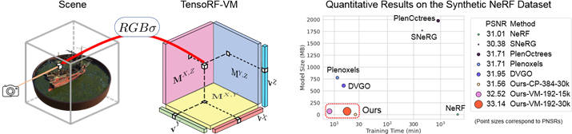

# NeRF 报告

## 1. NeRF 

(最初的) **NeRF (Neural Radiance Fields, 神经辐射场)**, 是一个**隐式**记录三维场景信息的 MLP 神经网络, 一种三维场景的表示方法.   

通过输入想要查询的视角方向, 结合场景中每个点的位置信息, 即可合成该视角下的场景视图. 

### 1.1. NeRF 的发展基础

NeRF 由 **神经网络定义隐式表面** 的一众方法发展而来. **神经网络定义隐式表面**, 即使用神经网络作为标量函数近似器来定义**占用率 (Occupancy Function)** 或 **符号距离函数 (Signed Distance Function, SDF)**, 作为**3D物体表面**. 

- 占用率, 用二进制值 0 或 1, 表示场景中的点是否在物体内部.
- 符号距离函数, 描述点与最近表面的距离 以及 该点相对于表面的位置 (内部或外部) 的函数; 通常对于 $SDF(x)$ , 点在物体内部返回负值, 外部返回正值, 边界返回 0. 

- **隐式神经网络**并不直接输出特定格式的结果, 而是学习了一个能够对任意查询点返回相关属性的函数. 对于 NeRF来说, 可以根据输入的3D坐标返回颜色和密度. 相比起来, “显式”神经网络会输出明确结果, 如图像识别、语音识别、NLP等. 

列举几篇早于 NeRF 的论文: 

1. [Occupancy networks](https://avg.is.mpg.de/publications/occupancy-networks)/ [IM-Net](https://github.com/czq142857/implicit-decoder) 基于坐标占用 (二进制占用) 的方法学习隐式神经网络, 只能计算白模, 无法渲染出颜色. 
2. [DeepSDF](https://github.com/facebookresearch/DeepSDF) 使用隐式神经网络学习形状的连续SDF. 只能计算白模, 无法渲染出颜色.    
3. [PIFu](https://shunsukesaito.github.io/PIFu/) 使用含CNN的隐式神经网络, 对于给定图像 (单张或多张都可) , 使用SDF计算白模, 同时将2D像素对齐到3D白模, 可以生成颜色, 且分辨率高. 

ps: NeRF是神经隐式方法, 但不是神经隐式表面方法, 并不能直接从中求出物体表面 (特别是高质量的表面). 然而实际应用中关注的最多的还是物体表面 (比如生成可编辑可操作的3D模型), 空白处和物体内部都是无效部分. 后续会看到有方法重新将NeRF发展回求取表面的方向. 

但是这不是说只关注表面会更好. 体积渲染关注全局, 更加真实地模拟了现实世界, 毕竟现实世界不是只有物体表面的. 关注整体是更全面的策略, 这也是NeRF渲染效果好的原因. 

### 1.2. NeRF 

#### 1.2.1. NeRF 创新点

NeRF 之所以能在众多同期方法中脱颖而出,得益于 NeRF 极佳的渲染效果 (精度高, 有颜色, 光线效果好等). 

以下二点是 NeRF 中重要的创新点 或对于其他方法的提炼:

- 将体积渲染方法引入隐式神经网络. 直观来说, 这使得 NeRF 有回归颜色的能力; 还有可能潜在提高了渲染精度. 
- 神经网络前加了重编码层, 利用三角函数提升输入的维度; 分层采样, 关注细节. 这使得渲染精度进一步提高. 

#### 1.2.2. NeRF 思路总结

- 训练: 即MLP函数. 该函数输入查询的点以及观看方向 $(x, y, z, θ, φ)$, 输出该观看方向下的颜色和密度 $(R, G, B, σ)$. 
- 渲染: 通过MLP查询所有点在所需视角的颜色密度, 进行体积渲染. 
- 训练过程中的优化方法: 查询方向对齐输入的**一组具有已知相机姿势的图像, 作为ground truth**, 进行梯度下降. 
- 改进1: 重新编码. 在MLP前加一层编码层, 将输入$(x, y, z, θ, φ)$ 重新编码用sin/ cos为更高维的张量, 适应细节
- 改进2: 分层采样. 粗采样区分空间空白部分和物体内部, 精采样重点关注物体边界细节. 用来节省内存以及加速. 

#### 1.2.3. NeRF 实现细节

1. 场景表示将一个连续场景表示为 5D 向量值函数, 其输入是 3D 位置和 2D 观看方向 $x = (x, y, z) , d = (θ, φ)$, 其输出是发射颜色和体积密度 $c = (R, G, B), σ$.   

1. 神经网络架构: 在重编码层之后, MLP $F_{\Theta}$  首先处理具有 8 个全连接层的输入 3D 坐标 $x$ (使用 ReLU 激活和每层 256 个通道) , 然后输出 σ 和 256  维特征向量. 然后, 该特征向量与相机光线的观看方向连接, 并传递到一个额外的全连接层 (使用 ReLU 激活和 128 个通道) , 该层输出与视图相关的 RGB 颜色. 这种方法分隔得方法可以促使多视图一致. 

2. 体积渲染方法: 预期颜色 $C(r)$ 的积分形式: 
$$C(\mathbf{r})=\int_{t_n}^{t_f}T(t)\sigma(\mathbf{r}(t))\mathbf{c}(\mathbf{r}(t),\mathbf{d})dt\:,\:\text{where}\:T(t)=\exp\left(-\int_{t_n}^t\sigma(\mathbf{r}(s))ds\right)$$
- $C(r)$: 表示在点 r 处的颜色.  
- $t_n$和 $t_f$: 表示路径的起始点和终止点.   
- $σ(x)$: 体积密度, 可以解释为光线终止于位置 x 处的无穷小粒子的微分概率.   -- `alpha = raw2alpha(raw[..., 3] + noise, dists)`  
- $T(t)$: 透射率, 表示从路径起始点 $t_n$ 到当前点 $t$ 的透射率, 通过对路径上的吸收函数 $σ(r(s))$ 进行积分来计算. 即, 射线从tn传播到t而不击中任何其他粒子的概率.   -- `weights`  
- $\sigma(r(t))$: 表示在路径上的点 $\mathbf{r}(t)r(t)$ 处的体积密度 (opacity) . 这由网络预测并通过函数 `raw2alpha` 转换得到, 表示为 `alpha`.   
- ${c}(r(t),d)$: 表示在路径上的点 $r(t)$ 处的颜色, 其中 $d$ 是观察方向.   
- $r(t) = o + td$: 相机光线路径, 其中 $o$ 是光线原点.    -- `pts = rays_o[..., None, :] + rays_d[..., None, :] * z_vals[..., :, None]`   
- $d$: 光线方向.   
- $t$: 一个沿着光线方向的距离参数.   

1. 体积渲染离散化近似: 
$$\hat{C}(\mathbf{r})=\sum_{i=1}^NT_i(1-\exp(-\sigma_i\delta_i))\mathbf{c}_i\:,\:\text{where}\:T_i=\exp\left(-\sum_{j=1}^{i-1}\sigma_j\delta_j\right)$$

- $\hat{C}(\mathbf{r})$ : 这是沿着光线 \(\mathbf{r}\) 累积的估计颜色, 通过对沿光线的离散点求和来近似. 
- $\sigma_i$: 表示第 $i$ 个采样点的密度.  -- $\sigma(r(t))$  
- $\delta_i$: 表示第 $i$ 个采样点和前一个采样点之间的距离.  -- 积分步长
- $c_i$: 表示第 $i$ 个采样点的颜色.  -- ${c}(r(t),d)$  
- $T_i$: 是从光线起点到第 $i$ 个采样点之间的累积透明度, 计算方法是对之前所有采样点的 $\sigma_j \delta_j$ 求和再取负指数. 

5. 位置编码 (PE, Positional Encoding). 深度网络偏向于学习**低频函数** (频谱偏差): 让网络 $F_{\Theta}$ 直接对 $(x, y, z, θ, φ)$ 输入坐标进行操作会导致渲染在表示颜色和几何的高频变化方面表现不佳. 所以在将输入传递到网络之前, 使用高频函数将输入映射到更高维度的空间, 可以更好地拟合包含高频变化的数据. 
$\gamma$ 是 $R$ 到更高维 $R^{2L}$ 的映射；$F_{\Theta}^{\prime}$ 并且仍然只是一个常规的 MLP. 编码函数如下: 
$$F_{\Theta}=F_{\Theta}^{\prime}\circ\gamma $$
$$\gamma(p)=\left(\sin\left(2^0\pi p\right),\cos\left(2^0\pi p\right),\:\cdots,\sin\left(2^{L-1}\pi p\right),\:\cos\left(2^{L-1}\pi p\right)\right)$$

    一个通俗的理解: 对于 Positional Encoding, 从一方面来讲, 它将欧式空间的样本点投影到频率空间, 也就是将点打散了, 在欧式空间相近的点在频率空间就会很远. 原本 MLP 很难拟合出“狭小”的欧式空间中的剧烈变化. 但在 Positional Encoding 将样本点投影到频率空间后, 这些“剧烈变化”在频率空间就显得相对平滑得多,  MLP 就能够很轻易地在频率空间拟合出这些变化, 但频率空间相较于欧式空间得求解空间大得多, 所以 MLP 依旧需要花费大量的时间去拟合. 

    另一个理解: NeRF 想做的事情是表征欧式空间中的一个场, 而 Positional Encoding 则是对欧式空间的三个轴分别引入了一组正交基函数, 此时 MLP 的任务就可以看作是学习得到这三组正交基函数的**系数表示**, 这个任务相比于让 MLP 去拟合高频特征显然要简单得多. 

6. 分层体积采样. 即使用两个网络 (粗略& 精细) 来表示场景. 先在粗采样点 $N_c$ 采样, 利用颜色计算采样光线上每个点可能为高密度点的概率, 再对密度高的区域点 $N_f$ 进行精细采样. 在所有 $N_c+N_f$ 个样本的基础上, 使用 之前的估计方程 计算光线的最终渲染颜色 $\hat{C}_f(r)$. 这有利于提升渲染精度, 提升训练/ 渲染速度.   
- 作者粗细两个层分为两个MLP. 其本质是粗MLP输入的点稀疏, 这就决定了他能渲染出的细节的上限, 所以需要另一个细MLP. 

1. $Loss$ 为 (粗渲染-精渲染) 与 (精渲染-真实RGB) 的**总平方误差**:  
$$\mathcal{L}=\sum_{\mathbf{r}\in\mathcal{R}}\left[\left\|\hat{C}_c(\mathbf{r})-C(\mathbf{r})\right\|_2^2+\left\|\hat{C}_f(\mathbf{r})-C(\mathbf{r})\right\|_2^2\right]$$
- $R$ 是每批的光线集合

#### 1.2.4. NeRF 缺点

NeRF 模型非常简单, 这是优点也是缺点 -- NeRF 仅仅使用 MLP 接受 5D 输入, 输出 4D 密度和颜色, 却达到了很好的效果, 表明如果再加改进, 会得到更好的模型. 列举可改进的方向如下:   

* 训练/ 渲染 速度慢
* 仅能表示静态场景
* NeRF bakes lighting, 失去了动态光的灵活性, 无法改变光的方向
* 无法泛化, 针对每个场景都需要重新训练
* NeRF 训练的模型无法编辑纹理贴图
* 相机位置苛刻, 需要的相片数量多, 实际应用受到限制
* 存在锯齿伪影等现象
* ……

## 2. NeRF 现有进展

### 2.0. Nerfstudio

[Nerfstudio](https://docs.nerf.studio/) 是一个框架, 通过模块化 NeRF 中的每个组件来简化 NeRF 新方法的开发, 使其扩展性和通用性很高. 

框架 (Pipeline) 如下:   

1. DataParser -- 用于处理不同类型数据的工具, 将各种数据转换为统一格式 (如 图片, 视频,  360 Data等)   
意义: 在NeRF发展的过程中, 有些方法是通过提供更优质的数据 (如 iphone 的 Record3D 格式, 自带 3D 信息, 会比用Colmap估计的效果好) 来优化NeRF的, DataParser 给各种数据提供一个统一处理方式. 

2. DataManager -- 用 DataParser 的数据生成光束对象 RayBundle 和 RayGroundTruth, 用于训练.

3. Model -- 模型主体, 几乎所有 NeRF 优化方法都涉及 Model. 作用是执行训练/ 渲染等过程. 

4. Field -- 求解器, 大多数 NeRF 优化方法都涉及 Field. 主要包含 get_density() 和 get_outputs() 两个类方法, 输入 RayBundle 和 RayGroundTruth, 计算返回每点密度和颜色 (也可以根据需求返回其他输出). 

5. Pipeline -- 连接各个模块, 传递参数, 整个流程在此完成. 

### 2.1. 加快训练/ 渲染

#### 2.1.1. 体素方法

1. **体素八叉树** -- 用于实现类似分层采样的功能, 但效果更优 (比NeRF快10倍左右). [Neural Sparse Voxel Fields](https://github.com/facebookresearch/NSVF) | NeurIPS2020_733 | [github](https://github.com/facebookresearch/NSVF)  
    * NSVF提出了一种新的隐式表示方法, 用于高效的自由视角渲染. 它由一组**体素边界隐式场**组成, 这些场被组织在一个**稀疏的体素八叉树**中. 这种方法的优点在于它可以通过**跳过不包含相关场景内容的体素**, 从而**加快新视角的渲染**. 与大多数显式的几何表示不同, 神经隐函数是平滑且连续的, 并且理论上可以实现高空间分辨率​​. 
    * 在体素八叉树中, 每个节点代表一个体素, 而该体素可以被进一步细分为八个更小的体素 (子节点) . 这种结构非常适合用于表示稀疏的3D数据, 因为它允许在具有复杂几何或属性的区域使用更细的分辨率, 同时在空旷或简单的区域使用较粗的分辨率. 体素八叉树常用于体积渲染和场景的几何优化, 因为它可以显著减少渲染和处理所需的数据量. 

2. **体素表示 张量分解** -- [TensoRF: Tensorial Radiance Fields](https://apchenstu.github.io/TensoRF/) | ECCV2022_405 | [github](https://github.com/apchenstu/TensoRF)   -- 同下

3. **稀疏体素网格 & 球谐函数** -- [Plenoxels Radiance Fields without Neural Networks](https://alexyu.net/plenoxels/) | CVPR2022_353 | [github](https://github.com/sxyu/svox2)  
    * Plenoxel 用球谐函数 (SH) 和体素网格 代替神经网络, 在稀疏体素 -- 即在无实体区域不填充体素 -- 的模型下进行渲染. 这一模型在单GPU上的典型优化时间仅为11分钟, 同渲染精度下比 NeRF 快两个数量级​​​​. 
    * 球谐函数 -- 最常用的球面基函数. 在NeRF中, 它可以实现数据的压缩存储 (只需要存储系数即可), 达到缩减内存加快渲染的作用. 相似的还有 球面高斯函数 SG (具体见NeRD). 
  
4. 体素网格 类似 [Direct Voxel Grid Optimization: Super-fast Convergence for Radiance Fields Reconstruction](https://sunset1995.github.io/dvgo/)

#### 2.1.2. 数值计算方法

1. **梯度网络自动化积分求解** -- [AutoInt: Automatic Integration for Fast Neural Volume Rendering](http://www.computationalimaging.org/publications/automatic-integration/) | CVPR2021_182 | [github](https://github.com/computational-imaging/automatic-integration) 
    * AutoInt能够通过**快速计算积分**加速渲染. 由于基于坐标的网络能够表示信号 (如图像、音频波形或3D形状) 及其导数. 通过对基于坐标的网络取导数, 可以创建一个新的计算方法, 称为“梯度网络”. 这个梯度网络可以针对需要积分的信号进行训练, 训练出一个闭式解的**原函数**, 大大加快积分计算时间. 

2. **体素表示 张量分解** -- [TensoRF: Tensorial Radiance Fields](https://apchenstu.github.io/TensoRF/) | ECCV2022_405 | [github](https://github.com/apchenstu/TensoRF)  -- [详](TensoRF.md)

    **TensoRF (Tensorial Radiance Fields, 张量辐射场)**, 在NeRF的基础上, 该方法首次从张量角度看待辐射场建模, 并将辐射场重建问题作为低秩张量重构之一提出. TensoRF将场景的辐射场建模为 4D 张量 (显式体素特征网格, 不是简单的特征网格) , 表示具有每个体素多通道特征的 3D 体素网格——**x, y, z和一个特征, 这个特征是一个通道, 涵盖颜色、视角等**. 优势: 
    - 显著降低内存占用
    - 加速训练 (百倍级别, CP < 30min；VM < 10min) 
    - 提高渲染速度 (zhi'liang) 
    - 减小模型大小 (CP < 4mb；VM < 75mb)    
    - 基于标准PyTorch, 实用性强

    

    关于张量分解: 在经典的CP分解已经有较好效果的基础上, 本文提出了vector-matrix (VM) 分解. 张量分解: 应用最广泛的分解是 Tucker 分解和 CP 分解 (都可以看作是矩阵奇异值分解 SVD 的推广) , 两者结合为块项分解 (BTD) . 本文新提出的 VM (Vector-Matrix)  分解是 BTD 的一种. 
        
        左图: CP分解, 将张量分解为向量外积之和. 右图: 我们的向量矩阵分解, 它将张量分解为向量矩阵外积的总和. 

#### 2.1.3. 模型结构优化

1. **组合小型分块网络** -- [KiloNeRF: Speeding up Neural Radiance Fields with Thousands of Tiny MLPs](https://arxiv.org/abs/2103.13744) | ICCV2021_443 | [github](https://github.com/creiser/kilonerf)   
    * KiloNeRF**将三维空间分成小块, 每块由一个独立的小型MLP处理** (作者项目约有数千个小型MLP) . 这种划分使得每个MLP只需要处理较小的数据量, 从而降低了计算复杂度, 同时可以更快地并行处理, 大大提高了渲染速度. KiloNeRF对每个小型MLP进行了优化, 以确保它们在处理速度和渲染质量之间达到良好的平衡. 
    * KiloNeRF实现了一种适应性渲染策略, 根据场景的复杂性动态调整MLP的数量和分布. 对于简单的场景部分, 可以使用更少的MLP, 而对于复杂的部分则使用更多, 从而在保持渲染质量的同时提高了效率. 这与NeRF原文思想类似, 但应用方式有变化. 

2. **多分辨率哈希编码 & 定制cuda** -- [Instant Neural Graphics Primitives with a Multiresolution Hash Encoding](https://github.com/nvlabs/instant-ngp) -- [详](instant-ngp.md)

    * 作者通过 **多分辨率哈希编码** 和 **定制cuda** 解决了其他NeRF方法中控制流和指针追逐的高成本问题. instant-ngp有自适应性和高效性. 

    * **多分辨率哈希编码** -- 给定一个 FNN -- $m(\mathbf{y};\Phi)$, 其中很重要的一部分是是输入 $\mathbf{y}=\mathrm{enc}(\mathbf{x};\theta)$ 的编码, 能在不增加性能开销的情况下加速训练提升渲染重建质量.  
    所以, instant-ngp 不仅训练了权重参数 $\Phi$, 还训练了编码参数 $\theta$  
    这些超参数分为 $L$ 级 (分辨率级数), 每个级别包含最多 $T$ 个维度为 $F$ 的特征向量. 每个级别 (其中两个在下图中显示为红色和蓝色) 都是独立的.   
    特征向量存储在网格的顶点处, 其分辨率 取 最粗 (Nmin) 和最细 (Nmax)分辨率之间的**几何级数**.  
    

    - Hash Table 本质上就是一个记录了离散映射关系的散列表 (记录着可反向传播训练的编码参数$\theta$. 这在普通位置编码是无法学习的), 作者通过如下方式实现了 Mapping：
      - 将空间进行规范化, 即将空间划分成网格. 每个网格顶点都有其量化的坐标. 同时初始化 Hash Table（即存有一堆值的列表）. 
      - 构建一个 Hash Function 从而建立每个网格顶点坐标到 Hash Table 的索引（图中网格顶点处圆内的数字就是对应的 Hash Table 的索引）. 
      - 对于输入的点 $x$, 找到他相邻的网格顶点, 然后利用 Hash Function 找到相应顶点在 Hash Table 的索引并取出对应的值；最后利用线性插值得到该点 $x$ 的值. 

    * 自适应性: 作者将需要重建的 NeRF网格 映射到相应的固定大小的特征向量数组. 
      - 在**粗略分辨率**下, 从网格点到数组条目的映射为 1: 1
      - 在**精细分辨率**下, 数组被视为**哈希表**, 并使用空间哈希函数进行索引, 其中多个网格点为每个数组条目添加别名. 这种**哈希冲突**会导致**碰撞训练梯度平均**, 这意味着最大的梯度 (与损失函数最相关的梯度) 将占主导地位. 因此, 哈希表会自动对稀疏区域进行优先级排序, 并具有最重要的精细比例细节. 

      与其他方法不同, 得益于**哈希冲突**的自动排序机制, instant-ngp 在训练期间的任何时候都不需要对数据结构进行结构更新. 

      ***哈希冲突**: 网格顶点的数量超过 Hash Table 的容量（超过列表长度）, 多个网格顶点对应 Hash Table 上同一个值.*

      相对通俗解释: 由于场景中大部分点是无效的 (通常关注的还是物体表面), 如果是无效区域的网格顶点和物体表面附近的网格顶点发生了冲突, 那通过梯度反传, Hash Table 中的值（即特征向量）会更加关注物体表面区域, 也就是Hash Table 中的特征主要是由物体表面附近的样本贡献的（或者说 Hash Table 的这个特征对恢复物体表面有显著作用）, 这很符合要求；另一方面, Hash Encoding 是由多个 Hash Table 组成, 因此总存在没有被哈希冲突严重影响的有效特征, 而 Instant-NGP 后接的 MLP 有能力处理这个哈希冲突, 提取正确的特征来恢复目标表征. 

    * 高效性: 
      - 哈希表查找操作的时间复杂度是常数时间 $O(1)$ (无论哈希表的大小如何, 查找操作的时间都是恒定的)
      - 不需要控制流 (即循环或条件判断等). 这可以高效地利用 GPU. (避免了树遍历中固有的执行分歧和串行指针追逐, 可以**并行查询**所有分辨率的哈希表)

### 2.2. 泛化

*泛化, 主流思想 : 预训练 (+ 微调)*  
*先在大的数据集上训练出普适性的神经网络的权重, (可选 : 再针对自己的数据集的特点, 再使用类似数据集进行微调模型), 最后将图片输入该神经网络, 得到定制的NeRF*

*也有一些工作不进行预训练*

#### 2.2.1. 预训练

类似的方法都需要大型数据集如DTU, 训练一个泛用模型, 然后对新给的图片可以生成NeRF. 局限性还是在于需要提前准备好的数据集的质量, 涵盖物品类别, 与大场景的生成. 比如要复刻汽车的NeRF, 最好提前训练含有很多汽车的数据集, 这个过程时间较长 (pixelNeRF论文中的例子iter40w, 时间6天).  

1. **像素对齐** -- [pixelNeRF: Neural Radiance Fields from One or Few Images](https://arxiv.org/abs/2012.02190) | CVPR2021_868 | [github](https://github.com/sxyu/pixel-nerf)  -- [详](pixelNeRF.md)

    主体分为两部分:
   * 一个全卷积图像编码器 $E$, 将输入图像编码为**像素对齐** (将图像的特征与原始图像中的每个像素位置直接对应起来?) 的特征网格
   * 一个 NeRF 网络 $f$, 输出颜色和密度, 给定空间位置及其相应的编码特征

    单图像实现细节:

   - 将坐标固定为 view space
   - 给定一个场景的输入图像, 提取**特征体积** $W = E(I)$
   - 对于相机射线上的一点 $x$, 通过使用已知的**内参数** (known intrinsics, 指的是相机的内参数, 如焦距等) 将 $x$ (3D) 投影到图像平面到图像坐标 $π(x)$ (2D) 上
   - 在 **逐像素特征 (Pixelwise features ? )** 之间进行**双线性插值**, 以此提取特征向量 $W(π(x))$.
   - 将位置, 方向, 图像特征 传递到 NeRF:  

   $$f(\gamma(\mathbf{x}),\mathbf{d};\mathbf{W}(\pi(\mathbf{x})))=(\sigma,\mathbf{c})$$

   其中, $\gamma(\mathbf{x})$ 表示位置编码 (就是在NeRF中用正弦余弦变换进行升维度以便提取高频特征的操作). 图像特征作为残差 (residual) 在NeRF的每一层中被整合. 

   

       单视图case, 输入到优化的流程. 
       
       对于沿目标相机光线方向为 d 的查询点 x, 通过投影和插值, 从特征体积 W 中提取相应的图像特征, 该特征与空间坐标一起传递到 NeRF 网络 f. (?这个特征到底是什么)
       
       输出 RGB 和密度值(基于体积渲染), 与目标像素值进行比较. 

#### 2.2.2. 未预训练

1. **几何/ 语义标签半监督** -- [SinNeRF: Training Neural Radiance Fields on Complex Scenes from a Single Image](https://vita-group.github.io/SinNeRF/) | ECCV2022_81 | [github](https://github.com/VITA-Group/SinNeRF)  
    * 对于NeRF来说, 直接在单一视图重建会导致严重过拟合, 导致其他视角画面崩坏. SinNeRF 对此, 构建半监督框架卷积网络, 对看不见的视角提供特殊的约束 -- 几何约束和语义约束, 而不是图像. 
    * 通过创新的网络架构和训练策略, SinNeRF能够从单一二维图像中推断出三维空间的信息, 包括丰富的纹理、复杂的光照条件和细节丰富的几何结构. 
    
    * **几何伪标签 & 深度一致性**: 通过使用现有的3D重建方法从单一图像中估计出**粗略的几何结构**, 产生所谓的**伪3D几何标签**. 这些伪标签不是完全精确的, 但提供了足够的几何信息来指导NeRF的训练. 例如其中的深度一致性约束, 渲染的图像在结构上应该与初始估计的3D几何结构相匹配. 
    * **语义伪标签 & 语义一致性**: 使用预训练的语义分割网络从单一视图中提取语义信息. 这些语义标签 (如物体边界、类别信息) 被用作额外的指导信息, 帮助NeRF理解场景中的不同物体和区域. 确保NeRF模型在渲染新视角时, 保持语义信息的一致性. 例如, 如果原始图像中的某个区域被标记为“树木”, 那么从新视角渲染的相同区域也应当被识别为“树木”. 
    * 为什么说是半监督? 由于伪标签不是真实的、完全准确的标签, 因此模型在训练过程中还需要依赖非监督学习的技术. 

### 2.3. 动态NeRF

1. **多维数据的二维分解** -- [K-Planes: Explicit Radiance Fields in Space, Time, and Appearance](https://openaccess.thecvf.com/content/CVPR2023/html/Fridovich-Keil_K-Planes_Explicit_Radiance_Fields_in_Space_Time_and_Appearance_CVPR_2023_paper.html) | CVPR2023_87 | [github](https://github.com/sarafridov/K-Planes) -- [详](K-planes.md)

    4D volumes可以分解为6个平面, 3个平面代表空间+3个平面代表时间变化, 分别为 $xy, xz, yz, xt, yt, zt$. 如下图:

    

    为了得到一个四维点 $q =(x, y, z, t)$, 
    - a. 将该点投影到每个平面上
    - b. 多尺度双线性插值
    - c. 内插值相乘, 然后在S尺度上进行连接
    - d. 这些特征可以用一个小的MLP  或作者提供的显式线性解码器进行解码. 
    - e. 标准的体积渲染公式 预测光线的颜色和密度
    - f. 在时空上的简单正则化来最小化重建损失进行优化

    这种结构对时间平滑性和多分辨率空间结构

### 2.4. 可编辑

选取了两篇文章. 两者都实现了NeRF可编辑性, 但采用完全不同的思路. 
- CLIP-NeRF: 匹配了文本图像对, 输入指令时直接更改NeRF的底层参数; 
- Instruct-N2N 通过**迭代更新数据集图像**并重新训练NeRF来实现编辑. 
- CLIP-NeRF 更加灵活, 思路更加复杂精巧, 但对于大场景下大规模NeRF的改变(比如在室外更换季节), CLIP-NeRF不适用, Instruct-N2N 虽然思路简单, 但借助Diffusion的强大图像编辑能力, 可以达到很好的效果. 而且 Instruct-N2N 没有更改架构, 可以作为插件加装到其他NeRF模型. 

1. **将CLIP模型引入NeRF** -- [CLIP-NeRF: Text-and-Image Driven Manipulation of Neural Radiance Fields](https://cassiepython.github.io/clipnerf/) | CVPR2022_190 | [github](https://github.com/cassiePython/CLIPNeRF)
    * CLIP -- Contrastive Language-Image Pre-training, 基于对比 **文本-图像对** 的预训练方法或者模型. CLIP包括两个模型: Text Encoder和Image Encoder, 其中Text Encoder用来提取文本的特征, 可以采用NLP中常用的text transformer模型；而Image Encoder用来提取图像的特征, 可以采用常用CNN模型或者vision transformer. 
    
    * CLIP-NeRF是首个实现使用 **文本提示 或 样例图像** 对NeRF进行操控的方法. 结合了最新的 CLIP 模型, 使用户能够实时编辑 NeRF 场景中的物体. 
    * 
    * 架构如上. 首先学习一个 **Disentangled条件NeRF** , 它以位置编码、视图方向、形状代码和外观代码(Shape code, 提前匹配场景中的物体与shapecode, 用于后续改变物体形状样式) 作为输入和输出渲染图像这种分离的条件NeRF以一种**对抗性的方式**进行训练. 然后给定一个参考图像或文本提示, CLIP图像或文本编码器提取相应的形状和外观映射器的特征嵌入, 分别在潜在空间中倾斜一个局部步骤, 用于形状和外观操作. 这两个映射器的训练使用一个CLIP相似性损失与我们的预训练解纠缠条件NeRF. 
    * **Disentangled Conditional NeRF** -- 首先 Conditional NeRF 即将在NeRF mlp的输入的5D坐标额外加入shape code zs  and an appearance code za. Disentangled Conditional NeRF在此基础上提出新的架构, 以单独控制形状和外观, 解决了在形状和外观(颜色)条件间相互干扰的问题. 

2. **将DIffusion模型引入NeRF**[Instruct-NeRF2NeRF: Editing 3D Scenes with Instructions](https://instruct-nerf2nerf.github.io/) | arXiv2023_70 | [github](https://github.com/ayaanzhaque/instruct-nerf2nerf)
    * 集成到了 Nerfstudio. 
    * 用文本指令编辑 NeRF 场景的方法. 该方法使用 InstructPix2Pix 的图像条件扩散 (difussion) 模型, 迭代地编辑输入图像. 重新训练了NeRF. 
    * 插件形式, 可以加装到大部分 NeRF 模型. 

### 2.5. 自然语言方法

1. **3D CLIP 自然语义查询/ 识别场景内物体** -- [LERF: Language Embedded Radiance Fields](https://www.lerf.io/) | ICCV2023
    * 使用3D CLIP特征, 直接嵌入NeRF场景. 查询时只需对照嵌入的特征. 

2. **将CLIP模型引入NeRF** -- [CLIP-NeRF: Text-and-Image Driven Manipulation of Neural Radiance Fields](https://cassiepython.github.io/clipnerf/) | CVPR2022_190 | [github](https://github.com/cassiePython/CLIPNeRF) -- 同上

3. **几何/ 语义标签半监督** -- [SinNeRF: Training Neural Radiance Fields on Complex Scenes from a Single Image](https://vita-group.github.io/SinNeRF/) | ECCV2022_81 | [github](https://github.com/VITA-Group/SinNeRF) -- 同上

### 2.6. 渲染质量

1. **优化位置编码 - 放宽对相机姿态的严格要求** -- [BARF: Bundle-Adjusting Neural Radiance Fields](https://chenhsuanlin.bitbucket.io/bundle-adjusting-NeRF/) |ICCV2021_346
    * BARF旨在解决NeRF在需要精确相机位置信息的限制. BARF允许从不完美或甚至未知的相机位置训练NeRF -- 对初始数据 粗略估计 或 完全随机的相机位置开始, 逐步调整相机姿态, 直到达到较标准的位置. 

    * 在BARF中, 发现在NeRF中**简单应用位置编码**会对相机姿态调整/ 渲染质量产生负面影响. BARF优化:
      * 初始阶段 (粗糙) : 在训练的开始阶段, 模型使用较低频的位置编码或完全不使用位置编码. 这允许模型首先捕捉场景的大致几何结构和全局特征, 而不是细节. 
      * 后续阶段 (细化) : 随着训练的进行, 逐渐增加位置编码的频率, 允许模型开始关注更精细的结构和细节. 

2. **视锥体 - IPE (Integrated Positional Encoding)** -- [Mip-nerf: A multiscale representation for anti-aliasing neural radiance fields](https://jonbarron.info/mipnerf/) | ICCV2021_791 

    * 在渲染过程中, 如果NeRF在每个pixel用single ray来sample场景,  (NeRF在做渲染时) 会出现模糊 (blurred, 近距离渲染) 和锯齿 (aliased, 远距离渲染) 的情况. 这种情况通常由于输入的同一个场景对应的**多个图片解析度 (resolution) 不一致而导致**的. -- 渲染时每个pixel下用多rays对NeRF来说并不现实, 计算量负荷太大. 

    * Mip-NeRF的解决方案和NeRF本质不同: NeRF渲染是要基于ray的, 然而Mip-NeRF是基于**视锥体**的, 能够通过解决 NeRF中忽略光线观察范围体积与大小的问题了, 从而解决以上的痛点, 更加适合处理multiscale的数据. 同时Mip-eRF不需要粗细两个MLP, 只用一个multiscale MLP就能完成

    * 视锥体 -- a.NeRF在从相机中心点出发射向当前pixel的一条射线上抽样一些列样本点x, 再通过positional encoding获得特称r(x)；然而, b.Mip-NeRF会从相机原点投射一个圆锥, 可以提取更大范围的表征. 
    

    * 为了减少计算量, 作者提出使用**3D Gaussian来近似圆锥采样**. 并提出了用IPE (Integrated Positional Encoding) 来取代positional encoding. IPE 为多元高斯分布的positional encoding的期望值

    * 一种理解 (从信号角度): PE的计算中所有频段都会被考虑到, 也包括了可能**超出采样频率的高频信息 (位置编码的采样频率仍然不足以捕捉信号中高频部分的变化)** -- 锯齿 (混叠) 产生的主要原因 -- 而IPE通过计算期望, 只需要考虑到γ (x) 的边缘分布, 集成了PE特征, 当存在频率周期小于被集成的频率周期时, IPE的高频维度将向零收缩, 从而具有更好的抗锯齿性能. 
    
      * 相对通俗地说, 越远的区域截断视锥越大, 即积分区域越大, 此时 Encoding 高频部分的均值迅速衰减到 0, 避免了远处样本点的突然出现的高频信号的影响. 相比 Mip-NeRF, NeRF 对深度没有那么敏感. 

      * 下图展示了近端 (蓝) 到远端 (红) 的采样方式对比. 近处细节多, 远处细节少. 当这一样本点处于较远位置, 但它又具有高频信号时, 则不利于 NeRF 的学习, 而 Mip-NeRF 改进了这一点
    

    * 缺点:  Mip-NeRF 相比 NeRF 能够非常有效且准确地构建 Multi-View 与目标物体的关系, 但这也意味着即**相机姿态** 的偏差会容易使 Mip-NeRF 产生更严重的失真. 不过NeRF本身就对相机姿态敏感, Mip-NeRF只是放大了这一缺点. 上面的工作就是解决方案之一. 

3. **处理边界** -- [Mip-nerf 360: Unbounded anti-aliased neural radiance fields](https://arxiv.org/abs/2111.12077) | CVPR2022_557 

    * Mip-NeRF 360 相较于 Mip-NeRF 主要是有三大贡献点：
        * 为了处理 unbound 的情况, 对坐标系进行了 收缩. 和另一篇处理边界文章 NeRF++ 有些许区别, NeRF++ 像是投影到单位球上, 通过 $1/r$ 进行远近判断; 本篇将球体分为两层, 内层不做处理, 外层将无穷远 收缩至内层同半径的外层. 由于坐标系发生了变换,  Mip-NeRF 中的 IPE 也进行了部分更改. 
        * 引入了 Proposed MLP. 即轻量化处理density的小MLP
        * 引入 distortion-based regularizer , 消除浮块和一些空缺的地方. 

### 2.7. 光照 (光源/ 几何/ 材质)

NeRF 的简化操作将物体的 geometry/material/lighting 耦合成了 density/appearance, 这一操作以低成本达到了高质量渲染结果, 但牺牲了灵活性. 改变光照的工作则是试图将 NeRF 的耦合进行解耦. 

这里有两种思路, 第一种是着手在NeRF的基础上修改架构/ 原理; 第二种是利用NeRF优秀的场景建模能力先得到场景的几何信息, 再添加 MLP 或其他方法进一步更改光照等. 

大量运用了BRDF的相关知识, 可见[此篇](https://blog.csdn.net/weixin_40064300/article/details/124596097?ops_request_misc=%257B%2522request%255Fid%2522%253A%2522170376655916800186560571%2522%252C%2522scm%2522%253A%252220140713.130102334..%2522%257D&request_id=170376655916800186560571&biz_id=0&utm_medium=distribute.pc_search_result.none-task-blog-2~all~top_click~default-2-124596097-null-null.142^v99^pc_search_result_base7&utm_term=BRDF&spm=1018.2226.3001.4187)

1. **开创** -- [Neural Reflectance Fields for Appearance Acquisition](https://arxiv.org/abs/2008.03824)
    * 不再将物体假设成光源 (发光粒子) , 而是带有反射性质的粒子, 光照则有外部的光源提供 (假设场景某处存在点光源点光源). 

    * 光源在着色粒子的过程中也需要考虑光路上由其他粒子导致的衰减 -- Adaptive transmittance volume, 在已知光源的情况下, 预计算好光源到空间中各个点的衰减程度, 然后将这些衰减程度信息存入网格中, 这样在渲染的过程中尽可以直接索引, 而不用再进行光路上的积分计算. 
    
    * 这里采用了闪光灯假设, 实现起来比较苛刻, 即 利用闪光灯相机拍摄图片, 所以唯一光源与相机原点重合, 简化了计算. 

2. **反射场和可见性场, 用于学习光照条件** -- [NeRV: Neural Reflectance and Visibility Fields for Relighting and View Synthesis](https://people.eecs.berkeley.edu/~pratul/nerv/)
    * 在NRF的基础上, 假设光源未知. 建模了一个可优化的环境光照 $E$ 来表示未知的光照条件. $E$ 用两个角度表示环境光 (假设光源来自无穷远处, 且与仅与视角方向有关) 
    * 此外, NeRV 引入 Visibility, 是Adaptive transmittance volume的延申, 都**表示 "粒子能看到光源的程度"**, 不同之处在于 NRF 是在做 Baking, 通过预计算将这些信息存起来方便最终的渲染；而 NeRV 是用一个可学习的 MLP 来表示, 希望在训练的过程中逐渐建模起来. 

3. **引入SG**-- [NeRD: Neural Reflectance Decomposition from Image Collections](https://markboss.me/publication/2021-nerd/) | Arxiv2020_316 | [github](https://github.com/cgtuebingen/NeRD-Neural-Reflectance-Decomposition)
    * 在光照的建模上选择了可优化的 Spherical Gaussian. 
    * NeRD 可以接受不同图片是在不同光照条件下拍摄获得的, 但需要目标物体的 mask. 

4. [NeILF++: Inter-reflectable Light Fields for Geometry and Material Estimation](https://yoyo000.github.io/NeILF_pp/) | ICCV2023_6
    * 比较全面的工作
    * 之前一篇 NeILF 研究的问题是如何在给定重建mesh的情况下重建material, 相当于拓展现有三维重建/ 计算摄影的管线, 
    * NeILF++ 统一了入射光与出射光, 并与neural surface reconstruction做了很好的结合, 真正实现了几何、材质、光照的共同优化. 

### 2.8. 回归神经隐式表面重建 (几何近似)

1. [Neus: Learning neural implicit surfaces by volume rendering for multi-view reconstruction](https://lingjie0206.github.io/papers/NeuS/)  
    Neus 超越原先的神经隐式表面方法的原因之一就是它利用了NeRF良好的关注全局的能力
    * 核心任务 -- 用神经隐式SDF zero-level set表示表面 (之 使用可微分渲染解决多视角重建需要 mask 的问题)
    * 核心方法 -- SDF-guided Volume Rendering -- 设法用一个转换函数将 SDF $f(\mathbf{x}),\mathbf{x}=\mathbf{o}+\mathbf{d}t$ 转换成体积渲染中的权重值 $w(t)$, 用来实现 $C(\mathbf{o},\mathbf{v})=\int_0^{+\infty}w(t)c(\mathbf{p}(t),\mathbf{v})dt$ (就是NeRF的公式)
    * 这个过程中, 通过一个可学习的标准差 s 来控制转换函数的带宽 (寻找可能是物体表面的区间). 一开始的带宽非常宽, 利于学习到整体形状（低频信号）, 也便于优化. 随着学习过程的深度, 带宽越来越窄, 越来越关注细节的优化（高频信号）, Volume Rendering 越来越接近 Surface Rendering 的效果. 
    * 具体来说这个转换得到的权值 $w(t)$ 应该满足
      * 无偏
    * 另外有一篇类似的VolSDF, 任务与本文相同, 方法也是通过转换函数得到权重参与积分, 但 VolSDF 则是通过控制采样的过程来实现 SDF-guided Volume Rending. 

### 2.9 其他方向

- 多分辨率表示. 即不同分辨率下准确还原场景. 

- 关节对象. 将NeRF生成的人物/ 动物 绑定骨骼, 可以实现动画等操作. 

- 合成大场景. 多个NeRF对象合成一个庞大的场景. 

- 一些专注于某小众方面的改进. 

许多其他文献归类于
    - [NeRF_InnovativeWork](NeRF_InnovativeWork.md)
    - [BeyondPixels: A Comprehensive Review of the Evolution of Neural Radiance Fields](https://arxiv.org/abs/2306.03000)

## 3. 复现结果

尝试复现了instant-ngp, nerfstudio (nerfacto), k-planes, LERF, TensoRF 等 (跑通代码)

重点关注 kplanes 在 nerfstudio 中扩展包的重构. 

详见 
- render video 
- [Reproduce_kplanes_nerfstudio](Reproduce_kplanes_nerfstudio.md)
- [github](https://github.com/SparklingPumpkin/fnspkg)
- 

## 4. 总结展望

- 渲染速度、质量的提升是无止境的, 虽然目前已经优化的非常快了. 虽然找到更快的方法可能是非常困难的. （实时渲染, 在拍摄视频的同时直接构建隐式神经网络, 对拍摄场景可以渲染出自定义的效果）
- 小众方向, 优化特定场景下的NeRF效果. 如无人艇 等实际应用场景的特殊优化. 
- 多模态与NeRF结合, 重现更加真实的场景. 
- 数学方向上的改进. 受启发于体素网格的张量分解/ k-planes等方法. 
- 架构更新, 如Mip-NeRF/ instant-ngp等. 
- VR、AR
- ......

