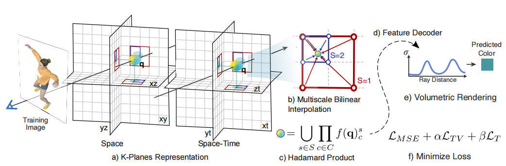

# K-Planes: Explicit Radiance Fields in Space, Time, and Appearance

## 1 特点
- 白盒模型, 可解释
- 4D volumes分解. 用3个平面代表空间+3个平面代表时间变化. 

## 2 主要流程

4D volumes可以分解为6个平面, 3个平面代表空间+3个平面代表时间变化. 如下图:

为了得到一个四维点 $q =(x，y，z，t)$, 
- a. 将该点投影到每个平面上
- b. 多尺度双线性插值
- c. 内插值相乘，然后在S尺度上进行连接
- d. 这些特征可以用一个小的MLP  或作者提供的显式线性解码器进行解码。
- e. 标准的体积渲染公式 预测光线的颜色和密度
- f. 在时空上的简单正则化来最小化重建损失进行优化

## 3 K-planes 模型

*有点类似于TensoRF的张量分解*

简单说, 这是一个可解释的, 用于分解表示**任意维度**场景的模型. 对 $d$ 维场景, 该模型将其分解为 $k=\bigl(\begin{smallmatrix}d\\2\end{smallmatrix}\bigr)$ 个平面进行处理

- 对于3D场景 (静态), 分解 $k=\bigl(\begin{smallmatrix}3\\2\end{smallmatrix}\bigr)=3$ 平面, 分别为 $xy, xz, yz$.
- 对于4D场景 (动态), 分解 $k=\bigl(\begin{smallmatrix}4\\2\end{smallmatrix}\bigr)=6$ 平面, 分别为 $xy, xz, yz, xt, yt, zt$.
- 对于5D...

### 3.1 平面

假设时间/ 空间分辨率 皆为 $N$, 特征维度为 $M$, 于是每个平面的形状为 $N{\times} N {\times} M$ 

对于一个4D点 $q=(i,j,k,\tau)$, 正则化后, 投影到平面:
$$f(\boldsymbol{q})_c=\psi(\mathbf{P}_c,\pi_c(\boldsymbol{q}))$$

$\pi_c$ 表示将点 $q$ 投影到 $P_c$平面上, $\psi$ 表示插值到规则二维网格. 最终用 Hadamard product 产生最后的长度为 M 的特征向量:
$$f(\boldsymbol{q})=\prod_{c\in C}f(\boldsymbol{q})_c$$

*为什么选择 Hadamard product 分解而不是像TensoRF VM分解中的加法乘法混合呢? 因为乘法组合更能体现局部的空间局部化特征. 此外, 经作者验证, 有利于对解码器进行改进.
    - 具体来说, MLP解码器参与了依赖于视图的颜色和确定空间结构，Hadamard积(元素乘法)减轻了特征解码器的这一额外任务，并使用单独负责视相关颜色的线性解码器达到类似的性能

### 3.2 特点

- **可解释性**

    **时空分离**的特性使得模型**可解释**, 并可以根据需求添加**特定维度的先验知识** (比如，如果场景的一个区域从未移动，它的时间分量将始终为 1). 特别是对于不随时间变化的点, 可以很方便的压缩. 

    场景的**静态部分**可以通过将三个时间平面设置为1 (乘法恒等式)来获得。从完整渲染中减去仅静态渲染的图像 (即时间平面参数未设置为1)，可以显示场景的**动态部分**。这种设置使得可视化很方便. 

- **多分辨率平面**

    较大尺度(低分辨率)的平面捕捉粗略的全局特征，而较小尺度的平面负责细节。这在很多其他模型都有相应的思想. 
    
    另外, 不对时间尺度做分离, 因为作者认为时间尺度具有的局部和全局特征不重要, 对模型帮助不大.  

    处理方式: 每个尺度单独编码, 连接, 传递给解码器. 

- **空间的总变分（Total variation in space）** 
    
    空间总变分正则化 鼓励稀疏梯度 (使用L1范数)或平滑梯度(使用L2范数)，分别提供 编码空间中稀疏或平滑边缘的先验

    Plenoxels，TensoRF中也使用了类似技术
    
- **时间的平滑性（Smoothness in time）** 

    在时间维度上，使用一维拉普拉斯 (二阶导数) 滤波器来平滑运动. 它计算每个点在连续三个时间步中的位置差的平方和，然后对所有点和所有时间步进行平均

    $\mathcal{L}_{smooth}(\mathbf{P})=\frac{1}{|C|n^{2}}\sum_{c,i,t}\lVert\mathbf{P}_{c}^{i,t-1}-2\mathbf{P}_{c}^{i,t}+\mathbf{P}_{c}^{i,t+1}\rVert_{2}^{2},(4)$

- **稀疏的瞬时状态（Sparse transients）** 

    通过将时空平面中的特征初始化为 1(可乘性恒等式)，并在训练期间在这些平面上使用 $L1$ 正则化项，使得场景的静态部分由空间平面建模

    $\mathcal{L}_{sep}(\mathbf{P})=\sum_c\lVert\mathbf{1}-\mathbf{P}_c\rVert_1,\quad c\in\{xt,yt,zt\}$

    如果对应的空间内容不随时间变化，k-planes 分解的时空平面特征将固定为 1. 对于动态变化不大地场景, 这很好地减轻了计算量. 

    

### 3.3 特征解码

作者使用了两种编码解码器, 一种为线性显示解码器, 一种为MLP

- 线性显示解码器: 使用空间局部化特征作为球调和(SH)基的系数的模型，以描述视点依赖的颜色

    与MLP解码器相比，这种SH解码器可以提供高保真重建和增强的可解释性，但是，SH系数很难优化，而且它们的表达能力受到所使用的SH基函数数量的限制

- MLP: 由两个小型MLP组成, 类似于instant-ngp

    $g_{\sigma}$ 将空间局部化特征映射为 密度 σ 和 附加特征 $\hat{f}$
    $g_{RGB}$ 将 $\hat{f}$ 和视图方向 $γ(d)$ 映射为RGB

两个解码器预测的 密度值 和 颜色值 最终分别通过 指数 和 sigmoid 进行归一化

### 3.4 优化细节

对于面向前方的场景，应用归一化设备坐标(NDC)来更好地分配分辨率，同时实现无限深度 -- 使用了Mip-NeRF 360中提出的场景收缩

- 建议采样

    使用Mip-NeRF 360建议采样策略的变体，以 k-planes 的小实例作为密度模型。建议采样通过沿一条射线迭代优化密度估计，在密度较高的区域分配更多的点。使用两级采样器，导致必须在整个模型中评估的样本更少，并通过将这些样本放置在更接近物体表面的地方，使细节更清晰。用于建议采样的密度模型使用直方图损失进行训练。

- 重要性采样: 

    针对多视角动态场景，从 DyNeRF 中实现了一种基于时间差分(IST)的重要性采样策略。在优化的最后一部分，根据前后25帧内颜色的最大变化比例对训练光线进行采样。这导致动态区域的采样概率更高。在静态场景与均匀采样的光线收敛后应用此策略。在实验中，IST对全帧指标只有适度的影响，但提高了小动态区域的视觉质量。重要性采样不能用于单目视频或具有移动摄像机的数据集。

