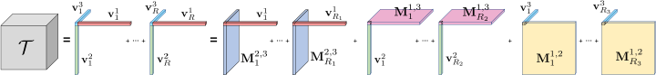
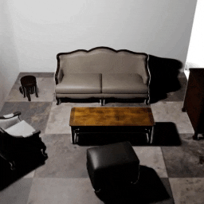

# NeRF_InnovativeWork

近年来，NeRF相关论文主要往两两方向发展：NeRF本身的分析和改进；基于NeRF框架的扩展。

Filter criteria: literature review/ most cited by papers/ newest

## 1. Pre_NeRF

*2019_CVPR/ ICCV*

NeRF 由 **神经网络定义隐式表面** 的一众方法发展而来。**神经网络定义隐式表面**，即使用神经网络作为标量函数近似器来定义占用率/ 符号距离函数，作为3D物体表面。

隐式神经网络网络并不直接输出特定格式的结果，而是学习了一个能够对任意查询点返回相关属性的函数。例如，神经辐射场（NeRF）可以根据输入的3D坐标返回颜色和密度。相比起来，“显式”神经网络会输出明确结果，如图像识别、语音识别、NLP等。

*更早的时候，许多 3D 感知图像生成方法使用体素、网格、点云或其他表示形式，通常基于卷积架构。*

1. Occupancy networks/ IM-Net 隐式的、基于坐标占用（二进制占用）的方法。只能计算白模，无法渲染出颜色。
2. DeepSDF（Signed Distance Function）使用神经网络学习形状的连续SDF。只能计算白模，无法渲染出颜色。   
*SDF —— 用于描述一个形状或物体的表面。SDF的核心概念是定义一个函数，这个函数对于空间中的每个点，给出该点到最近表面的距离，以及该点是在表面内部还是外部。*
3. PIFu 使用一种基于深度学习（含CNN）的隐式函数，该函数对于给定图像（单张或多张集成），从像素对齐的特征中回归颜色和 SDF，从而实现单视图重建。
4. ……

[Neural Volumes: Learning Dynamic Renderable Volumes from Images] 与NeRF类似，也使用 *体积渲染* 将输入图像转换为3D体积表示。

## 2. NeRF

基于以上 隐式神经方法，NeRF 取得了更好的渲染效果。从本质上讲，NeRF依然采用了 DeepSDF 架构，但回归的不是有符号距离函数，而是密度和颜色。

之所以能取得如此好的渲染效果，很大程度上得益于其 *位置编码*，在在隐式表面的高频变化方向得到了很好的效果。这项创新后来被推广到具有**周期性激活的多层网络**，又名 SIREN（SInusoidal REpresentation Networks），详见：
* *[Implicit Neural Representations
with Periodic Activation Functions](https://www.vincentsitzmann.com/siren/) 这篇文章的主要提供了一种神经网络优化方法，非常泛用，在图像、视频、音频、3D模型的细节方面都处理得很好。*

NeRF原论文效果好，并且模型简单 —— 仅仅使用MLP接受5D坐标并输出密度和颜色。因此，也留下了许多可以改进之处，如：  
* 训练、渲染慢
* 仅能表示静态场景
* it bakes lighting，失去了动态光的灵活性，无法改变光的方向
* A trained NeRF 无法泛化
* NeRF训练的模型无法编辑纹理贴图
* 相机位置苛刻，需要的相片数量多，实际应用受到限制
* ……

这几点都很重要。

## 3. NeRF_Improved

### 3.1 Performance
*Performance-改善性能。以下分类只是大致分类，许多文章都在很多方面有改进，有交叉部分*   

#### 3.1.1 加快渲染Faster Inference
1. [DyLiN: Making Light Field Networks Dynamic](https://dylin2023.github.io/) | CVPR2023_2(被引用次数) | [github](https://github.com/Heng14/DyLiN)   
    * DyLiN是对传统的光场网络的扩展，旨在处理动态场景中的非刚性变形，包括拓扑变化。光场网络是辐射场的重构，用于处理定向光线，相比于它们的坐标网络对应物，光场网络在表示2D观察中的3D结构方面更快速且保真度更高。然而，传统光场网络的限制在于它们仅适用于整体静态场景。DyLiN通过学习从输入光线到规范光线的变形场，并将它们提升到更高维空间以处理不连续性，从而克服了这一限制​​。

2. [R2L: Distilling Neural Radiance Field to Neural Light Field for Efficient Novel View Synthesis](https://arxiv.org/abs/2203.17261) | ECCV2022_36 | [github](https://github.com/snap-research/R2L)   
    * 这项研究通过将神经辐射场（NeRF）的信息提炼到神经光场（NeLF）中，以实现更高效的新视角图像合成。NeRF用于3D场景计算量较大，NeLF则是一种更高效的2D图像表示方法。通过将复杂的3D信息提炼为2D表示，R2L能够更快速地生成新视角的图像。

3. [KiloNeRF: Speeding up Neural Radiance Fields with Thousands of Tiny MLPs](https://arxiv.org/abs/2103.13744) | ICCV2021_443 | [github](https://github.com/creiser/kilonerf)   
    * KiloNeRF**将三维空间分成小块，每块由一个独立的小型MLP处理**（约有数千个小型MLP）。这种划分使得每个MLP只需要处理较小的数据量，从而降低了计算复杂度，同时可以更快地并行处理，大大提高了渲染速度。KiloNeRF对每个小型MLP进行了优化，以确保它们在处理速度和渲染质量之间达到良好的平衡。
    * KiloNeRF实现了一种适应性渲染策略，根据场景的复杂性动态调整MLP的数量和分布。这意味着对于简单的场景部分，可以使用更少的MLP，而对于复杂的部分则使用更多，从而在保持渲染质量的同时提高了效率。这与NeRF原文思想类似，但应用方式有变化。

4. [AutoInt: Automatic Integration for Fast Neural Volume Rendering](https://arxiv.org/abs/2012.01714) | CVPR2021_182 | [github](https://github.com/computational-imaging/automatic-integration)      
    * AutoInt通过**自动化积分**过程来加速神经体积渲染。AutoInt的快速渲染能力使其在许多需要实时或近实时渲染的应用中具有潜在价值，如虚拟现实、增强现实和计算机游戏。

5. [Neural Sparse Voxel Fields](https://github.com/facebookresearch/NSVF) | NeurIPS2020_733 | [github](https://github.com/facebookresearch/NSVF)  
    * NSVF提出了一种新的隐式表示方法，用于高效的自由视角渲染。它由一组**体素边界隐式场**组成，这些场被组织在一个**稀疏的体素八叉树**中。这种方法的优点在于它可以通过**跳过不包含相关场景内容的体素**，从而**加快新视角的渲染**。与大多数显式的几何表示不同，神经隐函数是平滑且连续的，并且理论上可以实现高空间分辨率​​。
    * 在体素八叉树中，每个节点代表一个体素，而该体素可以被进一步细分为八个更小的体素（子节点）。这种结构非常适合用于表示稀疏的3D数据，因为它允许在具有复杂几何或属性的区域使用更细的分辨率，同时在空旷或简单的区域使用较粗的分辨率。体素八叉树常用于体积渲染和场景的几何优化，因为它可以显著减少渲染和处理所需的数据量。

#### 3.1.2 加快训练
*体素网格非常火热*

1. [TensoRF: Tensorial Radiance Fields](https://apchenstu.github.io/TensoRF/) | ECCV2022_405 | [github](https://github.com/apchenstu/TensoRF)   
    **TensoRF (Tensorial Radiance Fields，张量辐射场)**，在NeRF的基础上，该方法首次从张量角度看待辐射场建模，并将辐射场重建问题作为低秩张量重构之一提出。TensoRF将场景的辐射场建模为 4D 张量（显式体素特征网格，不是简单的特征网格），表示具有每个体素多通道特征的 3D 体素网格——**x, y, z和一个特征，这个特征是一个通道，涵盖颜色、视角等**。优势：
    - 显著降低内存占用
    - 加速训练（百倍级别，CP < 30min；VM < 10min）
    - 提高渲染速度（zhi'liang）
    - 减小模型大小（CP < 4m；VM < 75m）   
    - 基于标准PyTorch，实用性强

    
    关于张量分解：在经典的CP分解已经有较好效果的基础上，本文提出了vector-matrix (VM) 分解。张量分解：应用最广泛的分解是 Tucker 分解和 CP 分解（都可以看作是矩阵奇异值分解 SVD 的推广），两者结合为块项分解（BTD）。本文新提出的 VM（Vector-Matrix） 分解是 BTD 的一种。
        
        左图：CP分解，将张量分解为向量外积之和。右图：我们的向量矩阵分解，它将张量分解为向量矩阵外积的总和。

2. [Plenoxels Radiance Fields without Neural Networks](https://alexyu.net/plenoxels/) | CVPR2022_353 | [github](https://github.com/sxyu/svox2)  
    * Plenoxel模型是一种基于视角依赖的**稀疏**体素模型，它能够以与神经辐射场（NeRF）相同的保真度进行优化，但**不需要任何神经网络**。这一模型在单GPU上的典型优化时间仅为11分钟，比NeRF快两个数量级​​​​。

3. [Direct Voxel Grid Optimization: Super-fast Convergence for Radiance Fields Reconstruction](https://arxiv.org/abs/2111.11215.pdf) | CVPR2022_401 | [github](https://github.com/sunset1995/DirectVoxGO)  
    * 此文提出了一种用于重建每个场景的辐射场的超快收敛方法。这种方法的关键是**直接优化在密集体素网格中建模的体积密度**。与NeRF和它的变体不同，这种方法不需要从任何训练过的隐式模型转换步骤或跨场景预训练，而是可以直接且高效地从头开始为每个场景进行训练​​。

#### 3.1.3 一般化Generalization

1. [SinNeRF: Training Neural Radiance Fields on Complex Scenes from a Single Image](https://vita-group.github.io/SinNeRF/) | ECCV2022_81 | [github](https://github.com/VITA-Group/SinNeRF)  
    * 该研究聚焦于使用单张图像来训练复杂场景的NeRF。
    * 通过创新的网络架构和训练策略，SinNeRF能够从二维图像中推断出三维空间的信息，这使得从单一视角图像生成的三维场景具有逼真的深度感和细节。尽管只依赖单一图像，SinNeRF依然能够处理和重建复杂的场景。这包括丰富的纹理、复杂的光照条件和细节丰富的几何结构。

4. [MVSNeRF: Fast Generalizable Radiance Field Reconstruction from Multi-View Stereo](https://apchenstu.github.io/mvsnerf/) | ICCV2021_378 | [github](https://github.com/apchenstu/mvsnerf)  
    * 将多视角立体视觉（Multi-View Stereo, MVS）和NeRF结合。传统的NeRF方法在处理新场景时需要长时间的训练。MVSNeRF通过特殊的网络设计和训练策略（设计了一种高效的数据处理流程，能够快速处理输入的多视角图像），实现了对新场景的快速适应，即使是在只有有限视角数据的情况下也能快速重建出高质量的三维场景。作者在多种场景下都显示出了良好的适应性和泛化能力，例如室内外场景、历史遗迹、自然景观等，显示了其在实际应用中的潜力。
 
5. [IBRNet: Learning Multi-View Image-Based Rendering](https://ibrnet.github.io/static/paper.pdf) | CVPR2021_459 | [github](https://github.com/googleinterns/IBRNet)   
    * 论文提出了一种自适应特征聚合机制，能够从多个输入图像中有效地提取和融合信息。这种机制使得网络能够根据不同场景自动调整其处理方式，提高了渲染质量和泛化能力。

6. [pi-GAN: Periodic Implicit Generative Adversarial Networks for 3D-Aware Image Synthesis](https://marcoamonteiro.github.io/pi-GAN-website/) | CVPR2021_572  
    * pi-GAN是一种用于3D感知图像合成的生成对抗网络。
    * pi-GAN专注于生成3D感知的图像，这意味着它不仅能产生高质量的2D图像，还能捕捉这些图像背后的3D几何结构。这一点在虚拟现实、增强现实和3D建模等领域尤为重要。
    * pi-GAN利用了生成对抗网络的架构，其中生成器试图产生越来越逼真的图像，而鉴别器则试图区分生成的图像和真实图像。这种机制使得pi-GAN能够生成高度逼真的图像。

7. [pixelNeRF: Neural Radiance Fields from One or Few Images](https://arxiv.org/abs/2012.02190) | CVPR2021_868 | [github](https://github.com/sxyu/pixel-nerf)   
    * 此文提出pixelNeRF，能够根据一个或几个输入图像预测连续的神经场景表示。
    * 从少量视角生成NeRF。pixelNeRF能够从极少量的视图（**甚至一个视图**）中预测出NeRF——这是通过将NeRF条件化在输入图像的**全卷积图像特征网格**上来实现的。这样的设计使得网络能够在多个场景上进行训练，学习到场景先验（pixelNeRF利用与每个像素对齐的空间图像特征作为输入），从而能够以前馈方式从稀疏的视图集合中进行新视角合成​​。
    * pixelNeRF在**输入图像的相机坐标系而非规范坐标框架**中预测NeRF表示。这不仅对于泛化到未见过的场景和对象类别至关重要，而且由于在有多个对象或真实场景中没有明确的规范坐标系，这种方法也更具灵活性。

8. [GRAF: Generative Radiance Fields for 3D-Aware Image Synthesis](https://arxiv.org/abs/2007.02442) | NeurIPS2020_599 | [github](https://github.com/autonomousvision/graf)
    * GRAF将NeRF技术与**GAN框架**结合起来。NeRF用于创建连续的3D场景表示，而GAN则用于提高生成图像的真实性。这种结合允许GRAF同时捕捉3D场景的几何细节和视觉真实感。

#### 3.1.4 Video

5. [DynIBaR: Neural Dynamic Image-Based Rendering](https://dynibar.github.io/) | CVPR2023_24 | [github](https://github.com/google/dynibar)  
    * 动态场景的新视角合成——论文解决了从单目视频中合成复杂动态场景新视角的问题。传统基于时间变化的NeRF（动态NeRF）在处理长视频、复杂物体运动和不受控相机轨迹时，可能产生模糊或不准确的渲染。DynIBaR通过采用基于体素的图像渲染框架来改善这些限制，该框架通过聚合邻近视图中的特征，并以对场景运动敏感的方式来合成新的视点。

1. [UV Volumes for Real-time Rendering of Editable Free-view Human Performance](https://fanegg.github.io/UV-Volumes/) | CVPR2023_10 | [github](https://github.com/fanegg/UV-Volumes)  
    * **UV体积技术**是一种新型的数据结构，它将3D空间中的人体表演编码为一系列2D纹理图，这些图通过UV映射关联到3D空间。这种方法相比传统的3D模型或点云表示，可以更高效地处理和渲染复杂的人体动作。该技术支持实时渲染，能够在没有预先渲染的情况下快速生成高质量的图像。这对于需要实时反馈的应用场景（如虚拟现实或交互式游戏）非常重要。  

6. [HumanNeRF: Free-viewpoint Rendering of Moving People from Monocular Video](https://grail.cs.washington.edu/projects/humannerf/) | CVPR2022_198 | [github](https://github.com/chungyiweng/humannerf)  

2. [Neural 3D Video Synthesis from Multi-view Video](https://neural-3d-video.github.io/) | CVPR2022_156
    * 多视角观察动态场景视频。通过分析这些视角，算法能够理解场景的3D结构。多视角视频合成三维视频，不仅包含时间上的动态变化，还包含空间上的深度和体积感。
    * 这种从多视角视频合成3D视频的技术在电影制作、虚拟现实、远程会议以及游戏开发等多个领域都有广泛的应用潜力。

3. [Neural Scene Flow Fields for Space-Time View Synthesis of Dynamic Scenes](http://www.cs.cornell.edu/~zl548/NSFF/) | CVPR2021_440 | [github](https://github.com/zhengqili/Neural-Scene-Flow-Fields)  
    * NSFF引入了场景流场的概念，这是一种用于描述场景中每个点随时间变化的3D向量场。这使得模型能够捕捉和理解场景中物体的运动和变化。NSFF特别关注在不同时间点生成视图的一致性，确保随时间变化时视觉效果的平滑过渡，这在处理视频和动态内容时尤为重要。
    * NSFF展示了在各种复杂动态场景下的强大性能，包括人物运动、自然环境变化等，表明其具有广泛的应用潜力。

4. [Neural Body: Implicit Neural Representations with Structured Latent Codes for Novel View Synthesis of Dynamic Humans](https://zju3dv.github.io/neuralbody/) | CVPR2021_415 | [github](https://github.com/zju3dv/neuralbody)  
    * Neural Body使用隐式神经网络来表示动态人体。这种表示方法不依赖于传统的3D网格或点云模型，而是通过连续的函数来描述人体的3D结构。论文引入了结构化潜码的概念，这些潜码能够捕捉动态人体的不同部位的动态变化。通过这种方式，模型能够更好地理解和重现人体动态。

#### 3.1.5 可编辑性

1. [SINE: Semantic-driven Image-based NeRF Editing with Prior-guided Editing Field](https://zju3dv.github.io/sine/) | CVPR_2023_23 | [github](https://github.com/zju3dv/SINE)
    * SINE是一种基于语义驱动的图像编辑方法，它允许用户通过单视图图像或文本提示来编辑逼真的神经辐射场，并能渲染出具有生动细节和多视角一致性的编辑后的新视角。
    * SINE提出了一种先验引导的 “编辑场”，用于在3D空间中编码精细的几何和纹理编辑。这包括循环约束与代理网格以促进几何监督，颜色合成机制以稳定语义驱动的**纹理编辑**，以及基于特征聚类的正则化以保持不相关内容不变​​。

2. [CLIP-NeRF: Text-and-Image Driven Manipulation of Neural Radiance Fields](https://cassiepython.github.io/clipnerf/) | CVPR2022_190 | [github](https://github.com/cassiePython/CLIPNeRF)
    * 多模态3D对象操控：CLIP-NeRF是首个实现使用文本提示或样例图像对NeRF进行操控的方法。它结合了最新的Contrastive Language-Image Pre-Training (CLIP)模型的联合语言-图像嵌入空间，提供了一个统一的框架，允许用户友好地使用文本提示或样例图像来操控NeRF（实时编辑）。

#### 3.1.6 姿态估计（Pose Estimation）
*从不完美的相机位置计算相同品质的内容*

1. [Loc-NeRF: Monte Carlo Localization using Neural Radiance Fields](https://arxiv.org/abs/2209.09050) | ICRA2023_33 | [github](https://github.com/MIT-SPARK/Loc-NeRF)
    * Loc-NeRF结合了Monte Carlo定位方法和NeRF，提出了一种实时的**基于视觉的机器人定位方法**。该系统使用预先训练的NeRF模型作为环境地图，并能够仅使用机器人上的RGB摄像头实时定位自身。
    * Loc-NeRF提出了一个6DoF（六自由度）姿态估计管道，该管道使用基于粒子滤波的Monte Carlo定位方法从NeRF中提取姿态。该管道在滤波器的更新步骤中使用NeRF作为地图模型，并在预测步骤中使用视觉惯性测量或机器人动态进行高精度的运动估计。
    * 适用于真实世界数据的实时跟踪：除了在合成数据上的测试外，研究者还使用由Clearpath Jackal UGV（无人地面车辆）收集的真实数据运行了系统，并首次展示了使用神经辐射场进行实时全球定位的能力。

2. [L2G-NeRF: Local-to-Global Registration for Bundle-Adjusting Neural Radiance Field](https://rover-xingyu.github.io/L2G-NeRF/) | CVPR2023_12 | [github](https://github.com/rover-xingyu/L2G-NeRF)  
    * L2G-NeRF提出了一种从本地到全局的注册方法，用于在NeRF中调整光束。这种方法首先进行**像素级**的灵活对齐，然后是**帧级**的受约束的参数对齐。像素级的本地对齐是通过一个深度网络以无监督的方式学习的，该网络通过优化光度重建误差来实现。帧级的全局对齐是使用可微分的参数估计求解器在像素级对应关系上执行的，以找到全局变换。
    * 在合成和真实世界数据上的实验表明，L2G-NeRF在**高保真重建**和**解决大范围相机姿态误差方面**优于当前的最先进方法。该模块是易于使用的**插件**，可以**应用于NeRF的各种变体和其他神经场应用**。

3. [BARF: Bundle-Adjusting Neural Radiance Fields](https://chenhsuanlin.bitbucket.io/bundle-adjusting-NeRF/) |ICCV2021_346
    * BARF提出了一种方法，用于**从不完美或未知的相机姿态中训练NeRF**。这一点在处理真实世界场景中常见的相机姿态不确定性时尤为重要。
    * 研究发现，简单地应用位置编码在NeRF中对于基于合成的目标有负面影响。这一发现对于优化NeRF的性能和准确性具有重要意义。

#### 3.1.7 光照

1. [NeRV: Neural Reflectance and Visibility Fields for Relighting and View Synthesis](https://people.eecs.berkeley.edu/~pratul/nerv/) | CVPR2021_383
    * NeRV方法接受一组在已知照明条件下拍摄的场景图像作为输入，并输出一个可以在任意照明条件下从新视角渲染的3D表示。这使得用户能够在**改变照明条件下**重新渲染场景，包括间接照明效果​​。传统的NeRF方法仅能模拟来自特定位置的光的出射量，而没有考虑入射光和物体表面材质属性之间的相互作用。这限制了NeRF在重新照明（relighting）方面的应用。NeRV通过**引入表面法线和材质参数的模型**，解决了这一问题​​。

2. [NeRD: Neural Reflectance Decomposition from Image Collections](https://markboss.me/publication/2021-nerd/) | Arxiv2020_316 | [github](https://github.com/cgtuebingen/NeRD-Neural-Reflectance-Decomposition)
    * NeRD使用基于**物理的渲染方法**对场景进行**分解**，将其分为具有**空间变化的双向反射分布函数（BRDF）材料属性**。这与现有技术不同，NeRD的输入图像可以在不同的照明条件下捕获。此外，还提出了一种将学习到的反射率体积转换为可重照明的纹理网格的技术，从而实现了**在新的照明条件下快速实时渲染**​​。

#### 3.1.8 多分辨率表示

1. [Variable Bitrate Neural Fields](https://nv-tlabs.github.io/vqad/) | SIGGRAPH2022_50 | [github](https://github.com/nv-tlabs/vqad)  
    **Vector-Quantized Auto-Decoder (向量量化自解码器VQ-AD)** 直接学习没有直接监督的信号的压缩特征网格。这种方法支持数据的渐进式、可变比特率流，允许根据可用带宽或所需的细节级别调整质量。  
    VQ-AD使用自解码器框架，专注于学习**压缩**表示。这包括用学习到的代码本中的索引替换庞大的特征向量，这些索引可以小到4位，而以前的方法中特征向量消耗512位。  
    不使用单一分辨率特征网格，而是支持不同细节级别的流。这种方法使得可以同时训练多个细节级别，这对于需要同时过滤和压缩的实时图形系统非常重要​。  
    压缩特征网格的字典方法，将其内存消耗降低了高达100倍。
 

#### 3.1.9 无约束照片输入

1. [NeRF in the Wild: Neural Radiance Fields for Unconstrained Photo Collections](https://nerf-w.github.io/) | CVPR2021_842
    * **适应未经约束的照片集合**，特别是互联网上的旅游地标照片集合。NeRF-W针对从未经约束的照片集合中合成复杂场景的新视角。与传统NeRF不同，它能处理诸如变化的照明或暂时遮挡物等真实世界现象。
    * NeRF-W放宽了NeRF的严格一致性假设，解决了典型的NeRF在处理现实世界数据集时遇到的问题。例如，NeRF要求同一位置和方向拍摄的任何两张照片必须是相同的，但在现实世界的数据集中，这种假设通常会被违反。
    * NeRF-W通过学习低维潜在空间来模拟每幅图像的外观变化，如曝光、照明、天气和后期处理。这种方法通过学习整个照片集合的共享外观表示来解释图像之间的光度和环境变化。
    * 场景内容的自动分解：NeRF-W将场景建模为**共享和图像依赖的元素的组合**，从而实**现场景内容的“静态”和“暂时”组件的无监督分解**。这种方法使用次要体积辐射场和数据依赖的不确定性场来模拟暂时元素。

#### 3.1.10 利用先验知识

1. [Dense Depth Priors for Neural Radiance Fields from Sparse Input Views](https://barbararoessle.github.io/dense_depth_priors_nerf/)
    * 密集深度先验来优化神经辐射场，以从少量输入图像渲染出完整房间的新视角。深度驱动的先验 —— 使用深度信息来辅助模型更准确地推断场景的三维结构。

### 3.2 Application
*扩展NeRF的应用*

#### 3.2.1 机器人

1. [3D Neural Scene Representations for Visuomotor Control](https://3d-representation-learning.github.io/nerf-dy/) | CoRL2021_80   
    * 这项研究集中于将3D神经场景表示应用于机器人和自动控制系统，以提高它们对环境的理解和交互能力。

2. [Loc-NeRF: Monte Carlo Localization using Neural Radiance Fields](https://arxiv.org/abs/2209.09050) | ICRA2023_33 | [github](https://github.com/MIT-SPARK/Loc-NeRF)
    * Loc-NeRF结合了Monte Carlo定位方法和NeRF，提出了一种实时的**基于视觉的机器人定位方法**。该系统使用预先训练的NeRF模型作为环境地图，并能够仅使用机器人上的RGB摄像头实时定位自身。
    * Loc-NeRF提出了一个6DoF（六自由度）姿态估计管道，该管道使用基于粒子滤波的Monte Carlo定位方法从NeRF中提取姿态。该管道在滤波器的更新步骤中使用NeRF作为地图模型，并在预测步骤中使用视觉惯性测量或机器人动态进行高精度的运动估计。
    * 适用于真实世界数据的实时跟踪：除了在合成数据上的测试外，研究者还使用由Clearpath Jackal UGV（无人地面车辆）收集的真实数据运行了系统，并首次展示了使用神经辐射场进行实时全球定位的能力。

#### 3.2.2 实时训练

1. [iMAP: Implicit Mapping and Positioning in Real-Time](https://edgarsucar.github.io/iMAP/) | ICCV2021_270
    * iMAP首次展示了如何将多层感知机（MLP）用作实时SLAM系统中唯一的场景表示，**适用于手持RGB-D摄像头**。这个网络在实时操作中进行训练，无需先验数据，构建了一个密集的、场景特定的隐式3D模型，用于占用空间和颜色表示，同时也立即用于跟踪​​。

#### 3.2.3 合成大场景 (Compositionality)

1. [GIRAFFE: Representing Scenes as Compositional Generative Neural Feature Fields](https://arxiv.org/abs/2011.12100) | CVPR2021_649
    * 与NeRF类似，GIRAFFE引入了一种组合式3D场景表示，这种表示方式将场景视为一系列可控的生成神经特征场。这允许模型区分单个对象与背景，以及它们的形状和外观，而无需显式的监督。

2. [Learning Object-Compositional Neural Radiance Field for Editable Scene Rendering](https://zju3dv.github.io/object_nerf/) | ICCV2021_175 | [github](https://github.com/zju3dv/object_nerf)
    * 这项研究提出了一种对象合成的神经辐射场，使得系统不仅能够进行静态场景的新视角合成，而且还具有对象级别编辑的能力。它通过学习场景中的单独对象和整体场景来实现更高级别的编辑任务，如移动或添加家具。

#### 3.2.4 头像

1. [Rodin: A generative model for sculpting 3d digital avatars using diffusion](https://3d-avatar-diffusion.microsoft.com/) | CVPR2023_44 | [github](https://3d-avatar-diffusion.microsoft.com/)  
    * 使用扩散模型自动生成以神经辐射场（Neural Radiance Fields, NeRF）表示的3D数字化头像。 
    * 为了解决在生成高品质头像时所需的丰富细节所带来的巨大内存和计算成本，论文提出了卷展扩散网络（Rodin）。Rodin将神经体积表示为多个2D特征图，并将这些图卷展到一个单一的2D特征平面中，然后在该平面内进行3D感知的扩散。这使得Rodin模型在保持扩散在3D中的完整性的同时，带来了急需的计算效率​​。
    * 3D感知卷积——明确考虑到一个2D特征在三面体平面（tri-plane）中的一个平面上是从3D数据中投影出来的，与其他两个平面上相同数据的投影特征内在相关，借此跨平面通信，同步细节的合成，以反映它们在3D中的关系。  
    * Rodin模型使用潜在向量来调控特征生成，使其在整个3D体积中全局一致，从而产生更高质量的头像，并支持基于文本提示的语义编辑。这是通过使用训练数据集中的头像来训练一个额外的图像编码器实现的，该编码器提取一个语义潜在向量作为扩散模型的条件输入。此外，模型采用了冻结的CLIP图像编码器，该编码器与文本提示共享潜在空间​​。

2. [Point-NeRF: Point-based Neural Radiance Fields](https://xharlie.github.io/projects/project_sites/pointnerf/index.html) | CVPR2022_187 | [github](https://github.com/Xharlie/pointnerf)  
    * 作者结合了NeRF（神经辐射场）和基于点云的深度多视图立体视觉（Multi-View Stereo, MVS）技术的优势，以解决现有方法在重建和渲染**高质量头像**时面临的一些挑战。以下是该论文的主要改进点：
    * 点基神经辐射场（Point-NeRF）表示：Point-NeRF使用**神经3D点云**及其相关的神经特征来模拟辐射场，每个神经点编码了其周围局部3D场景的几何和外观信息。这种表示形式不仅提高了渲染质量，而且使得模型能够更有效地重建和渲染场景，尤其是在避免在空场景空间中进行射线采样方面​​。
    * 基于点云的高效初始化和优化：Point-NeRF可以通过预训练的深度神经网络直接推断来初始化，生成一个神经点云。与仅依赖于每个场景拟合的NeRF不同，这种方法允许在短时间内对每个场景进一步优化，实现了更快速和精确的头像重建和渲染​​。
    * 处理重建点云中的错误和离群值：在处理像COLMAP这样的重建技术生成的点云时，Point-NeRF引入了点增长和剪枝机制。这一机制有效地改进了最终的重建和渲染质量，特别是在填补大型空洞和产生逼真渲染方面​​。
    * 更精细的局部场景几何和外观建模：与全局MLP编码整个场景空间的传统NeRF方法相比，Point-NeRF利用精细的神经点来模拟复杂的局部场景几何和外观，从而提供了更好的渲染质量​​。
    * 适应实际表面的点基表示：与基于体素网格的局部神经辐射表示相比，Point-NeRF的点基表示更好地适应了实际表面，从而提供了更高的质量。此外，该模型直接预测良好的初始神经点特征，绕过了大多数基于体素的方法所需的每个场景优化​​。
    * 神经点与空间变化的神经特征结合：Point-NeRF利用具有空间变化神经特征的神经点来编码其辐射场。这种局部化表示可以比纯粹的MLP（具有有限的网络容量）模拟更复杂的场景内容。更重要的是，Point-NeRF展示了其点基神经场可以通过预训练的深度神经网络高效初始化，并在场景中普遍实现高效的辐射场重建​​。

### 其他
    * 关节对象/ 深度估计/ 大场景/ 模型重构/ 多规模/ 类别/ 场景打标与理解/ 基础理论/ 先验知识 等

### 3.3 其他方向

1. [NeRF in the Dark:
High Dynamic Range View Synthesis from Noisy Raw Images](https://bmild.github.io/rawnerf/index.html) 
    * 这篇的渲染质量非常好，是特化黑暗环境下的方法。

## Review

[BeyondPixels: A Comprehensive Review of the Evolution of Neural Radiance Fields](https://arxiv.org/abs/2306.03000)

[NeRF: Neural Radiance Field in 3D Vision, Introduction and Review](https://arxiv.org/abs/2210.00379)

## 总结

### NeRF发展

刚提出时，NeRF本身有很多缺陷，如 其体积渲染的方法，既是优势也是劣势——

NeRF可能因其基于体积的方法而易于训练，但也正是因为基于体积的方法，计算了很多不必要的内容（物体内部与外部空白）。虽然NeRF原项目就已经有了这方面的优化（分层采样），但最新的一些论文展示的结果显示，还可以做的更好 —— 只预测表面（回归SDF），或重新使用体素表示。

但接近4年后的今天（2023/ 12，NeRF最初发表约在2020/ 01），提出新的观点优化NeRF（并且没有其他研究人员在做类似的工作）已经比较困难了。

NeRF相关论文增长速度非常之快。  

### 我能想到的方向

- NeRF的优化这几年有非常之多的方向，每个方向也有不同的优化思路。是否可以集合众家之长处？  
（我刚想到，搜了一下已经有了一个NeRF开源平台 —— [Nerfstudio](https://engineering.berkeley.edu/news/2023/07/researchers-create-open-source-platform-for-neural-radiance-field-development/)）
- 渲染速度、质量的提升是无止境的，虽然目前已经优化的非常快了。虽然找到更快的方法可能是非常困难的。（实时渲染，在拍摄视频的同时直接构建隐式神经网络，对拍摄场景可以渲染出自定义的效果）
- 小众方向，优化特定场景下的NeRF效果。如无人艇 等实际应用场景的特殊优化。
- 与大模型方向结合。比如处理大规模的3D场景？
- 多模态与NeRF结合，重现更加真实的场景。
- 数学方向上的改进。受启发于体素网格的张量分解。
- VR、AR。

