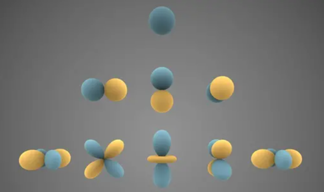

# 球谐波函数

[知乎](https://zhuanlan.zhihu.com/p/467466131)

## 谐波函数

**谐波函数**是指满足**谐振动方程**的数学函数   

**谐振动**是指一个系统以**恒定的频率和振幅**在**固定轨迹**上**振动**的运动形式

**谐波函数**的一种基本形式是  **正弦函数 & 余弦函数**

一般来说, 谐波函数可以表示为: 

$f(t)=A\cdot\sin(\omega t+\phi)$

## 函数展式

众所周知, 函数可以根据基函数 (通常正交) 展开. 如:

一维函数 $f(x)$ 的傅立叶变换 (将函数从时域或空域转换到频域的数学方法) 为

$F(\omega)=\int_{-\infty}^{\infty}f(x)e^{-i\omega x}dx$

其中 $e^{-i\omega x}$ 就是基底函数, 也称为谐波函数. 

## 拉普拉斯方程

球面坐标可表示为

$\left\{\begin{array}{c}x=r\sin\theta\cos\varphi\\y=r\sin\theta\sin\varphi\\z=r\cos\theta\end{array}\right.$

三维空间下的拉普拉斯（Laplace）方程可以表示为

$\nabla^2=\frac{\partial^2}{\partial x^2}+\frac{\partial^2}{\partial y^2}+\frac{\partial^2}{\partial z^2}=0$

球面坐标代入Laplace方程: D

$\frac{\partial^2}{\partial x^2}=\frac\partial{\partial x}\left(\frac\partial{\partial x}\right)=\frac\partial{\partial x}\left(\frac{\partial r}{\partial x}\frac\partial{\partial r}+\frac{\partial\theta}{\partial x}\frac\partial{\partial\theta}+\frac{\partial\varphi}{\partial x}\frac\partial{\partial\varphi}\right)$

$\frac{\partial^2}{\partial x^2}=\sin\theta\cos\varphi\frac\partial{\partial r}+r\cos\theta\cos\varphi\frac\partial{\partial\theta}-r\sin\theta\sin\varphi\frac\partial{\partial\varphi}$

得到: 

$\frac{1}{r^2}\frac{\partial}{\partial r}\left(r^2\frac{\partial f}{\partial r}\right)+\frac{1}{r^2\sin\theta}\frac{\partial}{\partial\theta}\left(\sin\theta\frac{\partial f}{\partial\theta}\right)+\frac{1}{r^2\sin^2\theta}\frac{\partial^2f}{\partial\varphi^2}=0$

## 正交多项式

$\int_{-1}^1F_m(x)F_n(x)dx=\left\{\begin{array}{ll}0&\quad(n\neq m)\\c&\quad(n=m)\end{array}\right.$

特别地，如果 c=1，那么这组正交多项式F(x) 就是标准正交(orthonormal)的。

## Legendre polynomials

Legendre Differential Equation:
 
$(1-x^2)\frac{d^2P(x)}{dx^2}-2x\frac{dP(x)}{dx}+n(n+1)P(x)=0$

Legendre Function 是 Legendre Differential Equation 的解: 

$\begin{aligned}P_0(x)&=1,\quad P_n(x)=\frac1{2^nn!}\frac{\mathrm{d}^n}{\mathrm{d}x^n}\left(x^2-1\right)^n,\quad x\in[-1,1], n&=1,2,\ldots\end{aligned}$

$\begin{aligned}P_0(x)&=1\\P_1(x)&=x\\P_2(x)&=\frac12(3xP_1(x)-P_0(x))=\frac12\big(3x^2-1\big)\\P_3(x)&=\frac13(5xP_2(x)-2P_1(x))=\frac12(5x^3-3x)\\P_4(x)&=\frac14(7xP_3(x)-3P_2(x))=\frac18\big(35x^4-30x^2+3\big)\\P_5(x)&=\frac15(9xP_4(x)-4P_3(x))=\frac18\big(63x^5-70x^3+15x\big)\end{aligned}$

$\begin{aligned}P_n(x)=\frac1{2^nn!}\frac{\mathrm{d}^n}{\mathrm{d}x^n}\left(x^2-1\right)^n, n&=1,2,\ldots\end{aligned}$

$\quad x\in[-1,1]$

正交性: 

$(P_n,P_m)=\int_a^bP_n(x)P_m(x)\mathrm{d}x=\begin{cases}\:0,&m\neq n\\\:\frac{2}{2n+1},&m=n\end{cases}$

而伴随勒让德多项式(ALP)则有两个参数 l,m，称为 l 次 m 阶伴随勒让德函数, 可以基于普通勒让德多项式 Pn(x)来定义 ：

$P_l^m(x)=(-1)^m(1-x^2)^{m/2}\frac{d^m}{dx^m}(P_l(x))$

$\begin{aligned}&P_0^0(x)\\\\&P_1^0(x),P_1^1(x)\\\\&P_2^0(x),P_2^1(x),P_2^2(x)\end{aligned}$

## 球谐波函数

$Y_l^m(\theta,\phi)=\left\{\begin{array}{rr}\sqrt{2}K_l^m\cos(m\phi)P_l^m(\cos\theta)&\quad(m>0)\\\sqrt{2}K_l^m\sin(-m\phi)P_l^{-m}(cos\theta)&\quad(m<0)\\K_l^0P_l^0(cos\theta)&\quad(m=0)\end{array}\right.$

放缩系数: 
$K_l^m=\sqrt{\frac{2l+1}{4\pi}\cdot\frac{(l-|m|)!}{(l+|m|)!}}$

SH，球谐函数，归根到底只是一组基函数, 有了基函数，就可以把任意一个函数，描述成几个基函数的加权和

本质上是一个有损压缩。有点像个密码本，你一本我一本，上面写了基函数的定义，这样传密码的时候只要传几个系数就可以了，系数传到我这儿，我能复原出y = f(x)，只是没那么准确了

## 球谐波函数与光

一般我们可以用SH coefficients来编码低频的环境光（因为边缘是亮度变化剧烈的高频信息，所以用SH来编码看起来糊糊的indirect lighting其实是比较合适的，例如拿来编码天光skylight）。至此，虽然还没涉及到PRT与着色相关的问题，但是你可以用Spherical Harmonics的"投影&重建"这对基本操作做你爱做的事了。

当用来描述不同方向光照的SH基函数我们一般用到二阶或者三阶，二阶是4个系数

