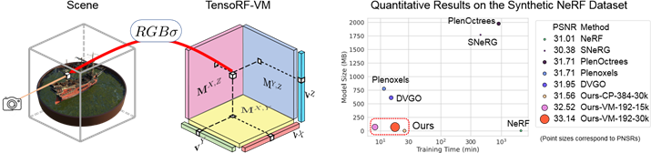
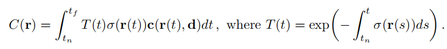
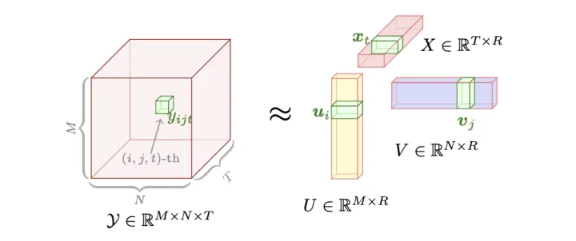

# TensoRF: Tensorial Radiance Fields

[TensoRF: Tensorial Radiance Fields](https://apchenstu.github.io/TensoRF/) | ECCV2022_405 | [github](https://github.com/apchenstu/TensoRF)   

## 1. 简介

起因: NeRF虽然模型内存占用小, 但训练时间长, 所以本篇针对训练时间进行改进, 同时保证内存占用不大, 渲染质量高. 

特点: 
- **将辐射场表示为显式体素特征网格, 张量化辐射场** —— 目前尚不清楚**单纯的体素网格表示**是否有利于重建的效率: 虽然以前的工作使用了特征网格提升渲染效率, 但它们需要大的GPU内存来存储体素, 其大小随分辨率呈立方增长. // 但TensoRF得方法利用体素网格可以看作4D张量 $x, y, z, σ$（σ为一个特征通道维度, 可以是颜色、密度等）的特性, 进行张量分解. 

- 因为张量表示离散数据, 故采用三线性插值, 获得更连续的表示

- 关于张量分解: 在经典的CP分解已经有较好效果的基础上, 本文提出了vector-matrix (VM) 分解. 张量分解: 应用最广泛的分解是 Tucker 分解和 CP 分解（都可以看作是矩阵奇异值分解 SVD 的推广）, 两者结合为块项分解（BTD）. 本文新提出的 VM（Vector-Matrix） 分解是 BTD 的一种.   
  
左图: CP分解, 将张量分解为向量外积之和. 右图: 我们的向量矩阵分解, 它将张量分解为向量矩阵外积的总和. 

## 2. CP 和 VM 分解

将**辐射场张量**进行**张量分解**之后, 每次运算只需要用到存储的分解出来的向量/ 矩阵, 高效地利用了数据, 可以显著减小内存占用, 加速运算. 
- CP分解将张量分解为向量积, 内存占用更少, 但运算步骤更多, 比VM分解稍慢. 
- VM分解反之, 分解为矩阵/ 向量积, 内存占用比CP分解多, 但相比不分解仍然大大减少；而且因为存储了矩阵的原因, 运算减少, 达到了内存-速度的平衡. 

以3D张量为例讨论. 

### 2.1 CP分解
*Candecomp/ Parafac*

对于任意 3D tensor $T ∈ R^{I×J×K}$, 另CP分解的秩为$R$, 任意元素$t_{ijk}$, 可记为: 
$$t_{ijk}\approx\sum_{r=1}^Rv_{ir}^1v_{jr}^2v_{kr}^3$$

其中, $\boldsymbol{U}\in\mathbb{R}^{M\times R},\boldsymbol{V}\in\mathbb{R}^{N\times R},\boldsymbol{X}\in\mathbb{R}^{T\times R}$, 是CP分解的因子矩阵 (factor matrix), 任意元素为$v_{ir}^1v_{jr}^2v_{kr}^3$, 任意列为向量$\mathbf{v}_{r}^1\in\mathbb{R}^M,\mathbf{v}_{r}^2\in\mathbb{R}^N,\mathbf{v}_{r}^3\in\mathbb{R}^T$, 故又可记为: 

$$\mathcal{T}=\sum_{r=1}^R\mathbf{v}_r^1\circ\mathbf{v}_r^2\circ\mathbf{v}_r^3$$

计算: 求分解出来的三个矩阵, 可以通过令偏导为0, [交替优化](https://www.zhihu.com/tardis/bd/art/474430528)数值求解. 

### 2.2 VM分解

#### 2.2.1 BTD

**块项分解**（Block Term Decomposition, BTD）: 将张量分解为**低秩张量项**的**和**来近似张量. **低秩的张量**在其各个维度上都**有较少的线性独立元素（低秩）**, 有如下优势: 
- 处理**低秩张量**相比于处理高秩或满秩张量在计算上更加**高效**. 低秩张量含有更少的独立参数, 在分解、重建、存储和分析这些张量时需要更少的计算资源. 
- 简化数据表示. 通过分解数据为低秩的组成部分, 可有效地去除冗余信息, 抓取关键特征, **用较少的数据来近似原始数据集**. 
- 可以在一定程度上抑制噪声和异常值. 噪声和异常值往往会增加数据的秩. 

换句话说: BTD 允许我们将一个较大的张量分解为结构化的小块, 这些小块可以 更容易、高效 地 分析处理数据. 

    这里 BTD 与 CP分解 很大的不同是分解为 张量的和.

**原理**: 张量乘法可视为 **N 个秩一张量（低秩张量）之和** （[链接](https://zhuanlan.zhihu.com/p/350470257?ivk_sa=1024320u)）, 所以张量分解的相乘形式可以近似转变为多个低秩张量之和, 而每个低秩张量又可以近似表示为 低维度的张量 外积, 所以对于待分解张量有如下公式: 

$$\mathcal{T}\approx\sum_{r=1}^R\mathcal{B}_r$$

进一步: 

$$\mathcal{B}_r=A_r\circ B_r\circ C_r$$

#### 2.2.2 VMD
**之后分解简称为 D*

VMD 将张量分解为多个向量和矩阵（其实就是从BTD演化而来, 与上面公式非常相近）: 

$$\mathcal{T}=\sum_{r=1}^{R_1}\mathbf{v}_r^1\circ\mathbf{M}_r^{2,3}+\sum_{r=1}^{R_2}\mathbf{v}_r^2\circ\mathbf{M}_r^{1,3}+\sum_{r=1}^{R_3}\mathbf{v}_r^3\circ\mathbf{M}_r^{1,2}$$

其中, $\mathrm{M}_r^{2,3}\in\mathbb{R}^{J\times K},\:\mathrm{M}_r^{1,3}\in\mathbb{R}^{I\times K},\:\mathrm{M}_r^{1,2}\in\mathbb{R}^{I\times J}$. 

    注意到这里的向量矩阵外积只能表示3维张量, 所以 VMD 实际上是为 3D 坐标系特化的张量分解方法. 第三节中可以看到为了特征通道, 这个公式又会有变化.

作者并未限制张量分解出来的其他mode（可以理解为特定的维度/ 方向/特性）, 只限制了其中一个mode（分解出来就是一个向量）的秩必须为一.  

    *可能是为了方便计算, 并且这样的规则不会对分解结果产生很大的影响. 甚至通过这种方式, TensoRF 允许在特定维度上 —— 就是秩一的mode —— 捕捉更复杂的数据模式, 同时在其他维度保持较低的复杂性. 既保持了计算效率也兼顾了复杂结构的处理.* ）*

不像在 CPD 中使用单独的向量, VMD将每两个mode组合起来并用矩阵表示它们, 从而允许**每个mode使用较少数量的分量进行充分参数化.** R1、R2、R3 可以设置不同, 应根据每种模式的复杂程度进行选择. 

    *即, 每个mode不需要太多的分量来描述其特性, 通过将两个mode结合在一个矩阵中, 可以更有效地捕捉这两个维度的联合特性, 而不是单独处理它们. 从而减少总参数数量，因为不需要为每个单独的mode维护一整套独立的参数.*

VMD的每个分量张量都比CPD的一个分量张量具有更多的参数。虽然这会导致较低的 **紧凑性 (compactness, 指的是数据表示的高效性, 紧凑性高就是低秩. 另外, VMD 相比不分解已经足够紧凑)**，但 VM 组件可以表达比 CP 组件更复杂的高维数据，从而在对相同的复杂函数进行建模时减少了所需的组件数量, 提高了运算效率.  

在场景建模中, 上述三个mode可以对应为 $X,Y,Z$, 并大多数情况下, 可另 R=R1=R2=R3, 所以可以表示得更简单:

$$\mathcal{T}=\sum_{r=1}^R\mathbf{v}_r^X\circ\mathbf{M}_r^{Y,Z}+\mathbf{v}_r^Y\circ\mathbf{M}_r^{X,Z}+\mathbf{v}_r^Z\circ\mathbf{M}_r^{X,Y}$$

## 3. 张量辐射场表示

辐射场的本质: $F_{\Theta}$ ：$(x，d) → (c，σ)$, 并支持可微光线进行; 体积渲染. 

TensoRF用 **体素多通道特征的3D网格** 对这个函数 $F_{\Theta}$ 建模: 分成几何网格 $\mathcal{G}_{\sigma}$ 和外表网格 $\mathcal{G}_c$ , 分别对应体积密度 $σ$ 和颜色 $c$ . $\mathcal{G}_{\sigma}\in\mathbb{R}^{I\times J\times K}, \mathcal{G}_{c}\in\mathbb{R}^{I\times J\times K\times P}$ .  $I, J, K$ 对应于 $X, Y, Z$ 的分辨率, $P$ 是外观特征通道数量. 

    理解: 这种分离使得每个网格可以专门化，更有效地捕捉各自的物理属性。分别处理体积密度和颜色信息可以提高计算效率。并且在一些渲染和图像处理的应用中，可能只需要体积密度信息（例如，用于计算阴影或光线穿透），而不需要颜色信息。分离的表示提供了更大的灵活性，使得可以根据需要独立处理这些信息。

选择函数 $S$ 可以用不同的方式将 $\mathcal{G}_c$ 中的外观特征向量和观看方向 $d$ 转换为颜色 $c$ -- 如果 $S$ 选择了小型MLP, 则对应 $\mathcal{G}_c$ 中的神经特征; 如果选择了球谐函数SH, 则对应 $\mathcal{G}_c$ 中的 SH 系数. 

    球谐函数(SH), 一种在球面上定义的数学函数，它们可以用来近似复杂的光照分布和反射模型。在图像处理和计算机图形学中，球谐函数常用于快速且有效地近似环境光照，特别是当光照的方向分布相对简单时。利用球谐函数，可以根据观察方向和球谐系数（SH coefficients）计算出表面的颜色。

$\mathcal{G}_{\sigma}$ 直接表示体积密度. 

**$\sigma,c=\mathcal{G}_\sigma(\mathbf{x}),S(\mathcal{G}_c(\mathbf{x}),d)$**

------

应用 VMD, 对于 $\mathcal{G}_\sigma$: 

$$\mathcal{G}_\sigma=\sum_{r=1}^{R_\sigma}\mathbf{v}_{\sigma,r}^X\circ\mathbf{M}_{\sigma,r}^{YZ}+\mathbf{v}_{\sigma,r}^Y\circ\mathbf{M}_{\sigma,r}^{XZ}+\mathbf{v}_{\sigma,r}^Z\circ\mathbf{M}_{\sigma,r}^{XY}=\sum_{r=1}^{R_\sigma}\sum_{m\in XYZ}\mathcal{A}_{\sigma,r}^m$$

**$\mathcal{A}_{\sigma,r}^m$只是一种简单表示方法.*  

对于 $\mathcal{G}_c$ , $P$ 作为外观特征通道数量通常较低 (例如只有RGB3个维度) , 也因此**低秩**, 可以单独拿出, 以 $b_r$ 表示. 

$$\begin{aligned}\mathcal{G}_c&=\sum_{r=1}^{R_c}\mathbf{v}_{c,r}^X\circ\mathbf{M}_{c,r}^{YZ}\circ\mathbf{b}_{3r-2}+\mathbf{v}_{c,r}^Y\circ\mathbf{M}_{c,r}^{XZ}\circ\mathbf{b}_{3r-1}+\mathbf{v}_{c,r}^Z\circ\mathbf{M}_{c,r}^{XY}\circ\mathbf{b}_{3r}\\&=\sum_{r=1}^{R_c}\mathcal{A}_{c,r}^X\circ\mathbf{b}_{3r-2}+\mathcal{A}_{c,r}^Y\circ\mathbf{b}_{3r-1}+\mathcal{A}_{c,r}^Z\circ\mathbf{b}_{3r}\end{aligned}$$

于是对于辐射场中的一个点 $x=(i,j,k)$, 该点的密度可以表示为: 
$$\mathcal{G}_{\sigma,ijk}=\sum_{r=1}^{R_\sigma}\sum_{m\in XYZ}\mathcal{A}_{\sigma,r,ijk}^m$$

对于该点的外观特征, $P$ 特征通道需要完整被计算: 
$$\mathcal{G}_{c,ijk}=\sum_{r=1}^{R_c}\mathcal{A}_{c,r,ijk}^X\mathbf{b}_{3r-2}+\mathcal{A}_{c,r,ijk}^Y\mathbf{b}_{3r-1}+\mathcal{A}_{c,r,ijk}^Z\mathbf{b}_{3r}$$

作者这里将 $\mathcal{A}_{c,r,ijk}^m (m = X, Y, Z;  r = 1, ..., R_c)$ 堆叠连接为 $\oplus[\mathcal{A}_{c,ijk}^m]_{m,r}$, 成为一个 $3R_c$ 维度的向量. $B$ 则是一个包含了所有 $b_r$ 向量的矩阵. 所以公式变为: 

$$\mathcal{G}_{c,ijk}=\mathbf{B}(\oplus[\mathcal{A}_{c,ijk}^m]_{m,r})$$

变形后的公式形式更简单, 计算也更方便. 

### 3.1 三线性插值

为了在模型的精细度 (连续性) 不受损的前提下, 保持高计算效率, 做使用了**三线性插值**(就是空间中三个方向的线性插值). 

传统的三线性插值方法在计算上可能相对昂贵。这是因为它需要评估八个相邻体素的张量值并插值它们。在每个插值点进行三线性插值相比于计算单个张量元素，**计算量增加了8倍**。

作者通过**插值张量的向量/矩阵因子**，**而不是直接插值张量本身**，可以自然高效地实现三线性插值。具体来说，即对于每个空间维度（XYZ），可以分别应用**线性插值**（对于向量因子）和**双线性插值**（对于矩阵因子）。这种方法实质上等同于对整个组件张量进行三线性插值，但计算成本更低。

例子: 

对于 $\mathcal{A}_r^X=\mathbf{v}_r^X\circ\mathbf{M}_r^{YZ}$ , 有插值: 
$$\mathcal{A}_r^X(\mathbf{x})=\mathbf{v}_r^X(x)\mathbf{M}_r^{YZ}(y,z)$$

$\mathcal{A}_r^X(\mathbf{x})$ 是 $\mathcal{A}_r$ 在 $\mathbf{x}=(x,y,z)$ 处的三线性插值. 剩下符号类似. 

同理: 
$$\begin{aligned}&\mathcal{G}_\sigma(\mathbf{x})=\sum_r\sum_m\mathcal{A}_{\sigma,r}^m(\mathbf{x})\\&\mathcal{G}_c(\mathbf{x})=\mathbf{B}(\oplus[\mathcal{A}_{c,r}^m(\mathbf{x})]_{m,r})\end{aligned}$$

### 3.3 渲染/ 重建

#### 3.3.1 渲染

结合前面几个关键方程, 最终张量分解辐射场可以表示为:

$$\sigma,c=\sum_r\sum_m\mathcal{A}_{\sigma,r}^m(\mathbf{x})\:,\:S(\mathbf{B}(\oplus[\mathcal{A}_{c,r}^m(\mathbf{x})]_{m,r}),d)$$

这描述了 CP 或 VM 分解的 TensoRF。借此, 在给定任何 3D 位置和观察方向的情况下, 获得连续的体积密度和与指定视图方向的颜色。这能够达成高质量的辐射场重建和渲染。

体积渲染方式同 NeRF: 
$$C=\sum_{q=1}^Q\tau_q(1-\exp(-\sigma_q\Delta_q))c_q,\:\tau_q=\exp(-\sum_{p=1}^{q-1}\sigma_p\Delta_p)$$

#### 3.3.2 重建

输入已知相机位置的多视角图像, 梯度下降最小化 L2 损失. 

仍然会出现过拟合/ 局部最小值/ 异常值/ 噪声. 优化方法: 
- 对于大多数数据集，仅应用 **L1 损失**足够.   
        
        因为 L1 损失促进稀疏性，能使模型的许多参数为零。这对于特征选择、去噪和计算效率提升很有帮助，尤其是在处理具有大量特征但只有少数几个是重要的情况下。

- 对于输入图像很少（如LLFF[36]）或拍摄条件不完善（如Tanks and Temples [26\u201231]，曝光度不同且蒙版不一致）的真实数据集，**总变分 TV 损失**比L1范数损耗更有效. 在一维情况下，它可以被理解为相邻点之间差的绝对值之和，即 $\sum_i|x_{i+1}-x_i|$ . 

        TV 损失鼓励信号或图像在局部保持平滑，同时允许在边缘处出现较大的变化。

- 使用 对于 **向量/ 矩阵** 的 **线性/ 双线性** 向上采样 实现粗细重建. 这对比NeRF原方法 (需要对其稀疏选择的体素集进行独特的细分) 简单很多. 

