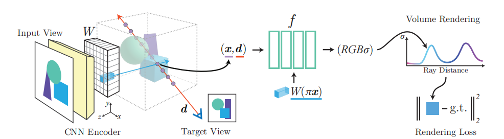

# pixelNeRF: Neural Radiance Fields from One or Few Images

[paper]((https://arxiv.org/abs/2012.02190))  
[github](https://github.com/sxyu/pixel-nerf)

## 1. 简介

pixelNeRF是一种学习框架，能够以前馈方式**从一张或几张图片还原连续神经辐射场.**

NeRF因其独立训练优化每个场景的特性, 难以泛化, 因此需要大量的摆拍图像. 

- pixelNeRF (在场景先验的基础上, ) 通过完全卷积的方式, 先计算图像特征网络, 在图像输入上调节 NeRF.   
***即, 提前处理输入图像, 得到 "特征", 作为额外的监督约束. 这个特征将与 $(x, y, z, θ, φ)$ 一起输入到神经网络.**

- 为了增强泛化性能, 还加入了**先验知识** (提前用数据集训练的模型文件). 可以在同一场景下共享以及学习到的知识.

- pixelNeRF 选择在输入视图的**相机空间**中对空间查询进行建模，而不是在标准空间中建模.   
*因为在相机空间（view space, 即以相机为原点, 固定观察方向的空间坐标系）中进行建模, 可以更好地重建未见过的对象类比 -- 使用相机空间不会强迫所有对象遵循一个预先定义或统一的规范姿态 (减少对训练集的记忆化)，这在处理多个对象或没有明确规范姿态的场景时特别有用。

-----

主体分为两部分:
- 一个全卷积图像编码器 $E$，将输入图像编码为**像素对齐** (将图像的特征与原始图像中的每个像素位置直接对应起来?) 的特征网格
- 一个 NeRF 网络 $f$，输出颜色和密度，给定空间位置及其相应的编码特征

-----
小记:

类似的方法都需要大型数据集如DTU, 训练一个泛用模型, 然后对新给的图片可以生成NeRF. 局限性还是在于需要提前准备好的数据集的质量, 涵盖物品类别, 与大场景的生成. 比如要复刻汽车的NeRF, 最好提前训练含有很多汽车的数据集, 这个过程时间较长(论文中的例子iter40w, 时间6天). 

## 2. 实施细节

### 2.1 单图像 pixelNeRF

- 将坐标固定为 view space
- 给定一个场景的输入图像, 提取**特征体积** $W = E(I)$
- 对于相机射线上的一点 $x$, 通过使用已知的**内参数** (known intrinsics, 指的是相机的内参数, 如焦距等) 将 $x$ (3D) 投影到图像平面到图像坐标 $π(x)$ (2D) 上
- 在 **逐像素特征 (Pixelwise features ? )** 之间进行**双线性插值**, 以此提取特征向量 $W(π(x))$.
- 将位置, 方向, 图像特征 传递到 NeRF:  

$$f(\gamma(\mathbf{x}),\mathbf{d};\mathbf{W}(\pi(\mathbf{x})))=(\sigma,\mathbf{c})$$

其中, $\gamma(\mathbf{x})$ 表示位置编码 (就是在NeRF中用正弦余弦变换进行升维度以便提取高频特征的操作). 图像特征作为残差（residual）在NeRF的每一层中被整合. 

    单视图case, 输入到优化的流程. 
    
    对于沿目标相机光线方向为 d 的查询点 x，通过投影和插值, 从特征体积 W 中提取相应的图像特征，该特征与空间坐标一起传递到 NeRF 网络 f。(?这个特征到底是什么)
    
    输出 RGB 和密度值(基于体积渲染)，与目标像素值进行比较。

#### 例子 -- 2D 投影

##### 假设场景：

- 3D 空间点：一个点 PP 在 3D 空间中的坐标为 $(x, y, z)$ 
- 相机参数：
    - 焦距 f：假设相机的焦距是一个定值 f。
    - 相机姿态：由一个旋转矩阵 R 和一个平移向量 t 表示，用于将世界坐标系中的点转换到相机坐标系中。

##### 3D 到 2D 转换过程

- 世界坐标 -> 相机坐标    
  $P_{\mathrm{cam}}=R\cdot P+t$
- 相机坐标 -> 归一化图像平面坐标    
  $x_{\mathrm{norm}}=x_{\mathrm{cam}}/z_{\mathrm{cam}},\:y_{\mathrm{norm}}=y_{\mathrm{cam}}/z_{\mathrm{cam}}$
- 归一化图像平面坐标 -> 实际图像坐标 (使用焦距 f 和 图像的主点 c)   
  $(u, v)=(f\cdot x_{\mathrm{norm}}+c_{x}, f\cdot y_{\mathrm{norm}}+c_{y})$

##### 对应代码

- 编码参数: 
    - images (NS, 3, H, W) 图像数目/ 颜色通道/ 高/ 宽
    - poses (NS, 4, 4) 图像数目/ 相机姿态矩阵 (4, 4), 3x3 旋转矩阵, 加平移
    - focal, c 焦距, 默认所有图像相同/ 主点, 默认中心

### 2.2 多图像

